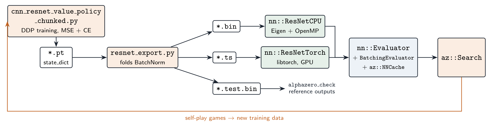
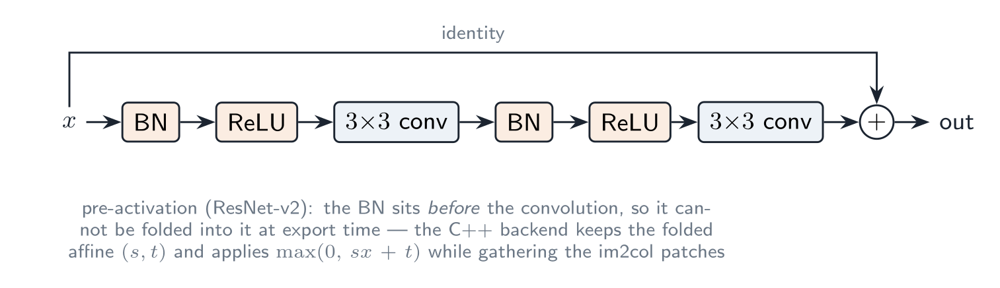
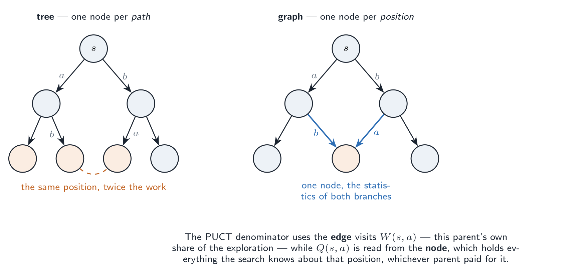

# What this document covers

The Yolah engine has two halves that only meet through a very thin interface.
On one side a two-headed residual network, trained in PyTorch, that looks at a
position and answers two questions: *who is winning?* and *what would a strong
player consider here?* On the other side a Monte-Carlo tree search that calls
that network a few hundred times per move and turns its two opinions into an
actual move — one much stronger than either opinion alone.

{#fig-pipeline width=100%}

This document explains both halves and the seam between them: the algorithm and
its formulas first, then the code that implements them, file by file. The
search is the one in `player/alphazero_mcts.{h,cpp}`; it started as plain
AlphaZero and has since been moved onto KataGo's formulation of PUCT, its
first-play-urgency rule, LCB move selection, graph search, and the two
self-play tricks from the KataGo paper (forced playouts and policy target
pruning). @sec-selfplay then closes the loop: the engine plays against itself
on a GPU cluster, learns from those games and gets stronger, for weeks, with
its progress measured by regular matches against its former selves, and
@sec-solving asks what it would take to compute exact values — endgame tables,
an exact solver — and whether Yolah could be solved.

Conventions used throughout:

* $s$ is a position, $a$ a legal move, $s\cdot a$ the position after it.
* $v \in (-1,1)$ is the network's value, always **for the player to move**.
* $z \in \{-1,0,+1\}$ is the final game result, also for the player to move.
* $P(s,a)$ is the network's prior, $Q(s,a)$ the search's running estimate,
  $N$ a visit count, $W$ a sum of values.

# The game, as far as the search is concerned

Yolah is played on $8\times8$ with four stones per side. A stone slides like a
queen, and **the square it leaves becomes a permanent hole**. The player who
moves scores one point per move; the game ends when neither side can move, and
the higher score wins.

Two consequences drive the design of the search.

**The state graph is acyclic.** In `Yolah::play` the move does
`empty ^= square_bb(m.from_sq())`, and `from_sq` always holds a stone, never a
hole — so the hole count increases by exactly one on every real move and can
never decrease. A position can therefore never repeat. No repetition detection,
no cycle handling, no draw-by-repetition: the search space is a DAG, and a
depth-first walk over it always terminates.

**Move orders commute.** The four stones of a side move independently, so
playing $a$ then $b$ with two different stones reaches exactly the same
position as $b$ then $a$. The same position is reachable through many paths,
which is what makes both the network cache and the graph search worth having.

The one wrinkle: a player with no legal move passes (`Move::none()`) and scores
nothing, while the opponent keeps moving. Two positions can therefore share a
board and a side to move while differing in how the points so far split between
the players — and the final result depends on that split. This matters for
hashing, and @sec-nodekey comes back to it.

# Position and move encoding {#sec-encoding}

The network sees four $8\times8$ binary planes: black stones, white stones,
holes, and a constant plane for the side to move.

{#fig-encoding width=100%}

Two details are easy to get wrong and are worth stating explicitly.

*The planes come out mirrored, and not on purpose.* Squares are numbered
`SQ_A1 = 0` through `SQ_H8 = 63`, and bit $s$ of a bitboard is square $s$. The
training cache turns a bitboard into a plane like this (`preprocess.py`):

```python
np.unpackbits(np.array([n], dtype='>u8').view(np.uint8)).reshape(8, 8)
```

`>u8` writes the integer big-endian — most significant byte first — and
`np.unpackbits` takes the most significant bit of each byte first. The 64 values
therefore come out in the order bit 63, bit 62, …, bit 0, so element $i$ is bit
$63-i$, which is square $63-i$. That is the whole origin of the $63-i$, and
`nn::encode_planes` has no choice but to repeat it:

```cpp
plane[i] = static_cast<float>((bb >> (63 - i)) & 1);
```

Geometrically: write $s = 8\,\text{rank} + \text{file}$ and reshape row-major,
and you get $\text{row} = 7 - \text{rank}$, $\text{col} = 7 - \text{file}$.
The ranks land the usual way round, rank 8 on the top row — but **the files are
mirrored**, H on the left and A on the right. Cell 0 is H8 and cell 63 is A1.

Nothing about the network minds. A fixed mirror of every input is just a
relabelling of the board, and the convolutions learn whichever labelling they
are shown. What matters is that training and inference agree *exactly*: an
encoder that helpfully "fixes" the order would feed the trained weights a
mirrored position, and the failure would be quiet — a network that has simply
become much weaker.

There is one place it could have bitten, and happens not to. The policy head
indexes actions by the **true** square numbers, $64\,\text{from} + \text{to}$,
not the mirrored ones — so the input geometry and the output indexing disagree.
It costs nothing because both heads flatten the trunk and pass through a
fully-connected layer, which absorbs any fixed permutation of its input. A
convolutional policy head emitting one logit per board square, as some AlphaZero
implementations use, would have had to be told about the mirror explicitly.

*The score is not an input.* The planes carry no score at all. The sum of the
two scores is recoverable — it is the number of holes — but the split is not.
The network is expected to learn what it needs from the piece and hole
configuration.

Moves use a flat AlphaZero-style action space of $64\times64 = 4096$ logits:

$$\text{action}(m) = 64\,\cdot\,\text{from}(m) + \text{to}(m)$$

Roughly three quarters of that space is never legal. Illegal actions are not
masked during training — they are simply never the target, so the softmax
starves them — and the search applies the legal mask itself: the evaluator
returns the logits of *exactly the legal moves*, in `Yolah::moves` order, and
the search softmaxes over those. A pass maps to A1→A1, index 0, which is never
a real move.

# The network

## Architecture

{#fig-net width=100%}

The trunk is a stem convolution followed by $B$ pre-activation residual blocks
and a final BatchNorm + ReLU. Both heads read the same $(C,8,8)$ feature map.

{#fig-resblock width=92%}

```python
class ResBlock(nn.Module):
    def forward(self, x):
        residual = x
        x = self.conv1(torch.relu(self.bn1(x)))
        x = self.conv2(torch.relu(self.bn2(x)))
        return x + residual
```

The **value head** squeezes $C$ channels to one with a $1\times1$ convolution,
flattens the resulting $8\times8$ map, and runs two fully-connected layers into
a $\tanh$. The output is the expected result for the side to move; a winning
probability is $(v+1)/2$.

The **policy head** squeezes to two channels, flattens to 128 features, and
projects to 4096 logits with a single fully-connected layer. That last layer
holds $4096\times128 \approx 524\,\text{k}$ weights and is, per position,
cheaper than one trunk block.

## Training

Two scripts define the same network and differ only in how they feed it.
`cnn_resnet_value_policy_chunked.py` is the one the shipped weights come from
and the one `resnet_export.py` imports; `cnn_resnet_value_policy.py` is its
sibling with a stock `DataLoader`, which is the right choice when the position
cache fits in page cache. Everything in this section applies to both unless
stated otherwise.

Both train the two heads at once on a supervised corpus of positions:

$$\mathcal{L} = \lambda_v\,\big(v - z\big)^2 \;+\; \lambda_p\,\text{CE}\big(\ell,\ a^\star\big)$$

with $\lambda_v = \lambda_p = 1$, as in AlphaZero. The value target $z$ is the
game result from the point of view of the player to move at $s$; the policy
target $a^\star$ is the single move actually played, so the policy loss is a
plain cross-entropy over the 4096 logits. Terminal positions have no next move
and carry `POLICY_IGNORE_INDEX = -1`, which `nn.CrossEntropyLoss(ignore_index=…)`
skips.

Note the asymmetry with a true AlphaZero loop: here the policy target is a
*one-hot move*, not a visit distribution. When the self-play loop of
@sec-selfplay is running, the target becomes the search's $\pi$ and the loss
term becomes $-\sum_a \pi(a)\log p(a)$ — the same cross-entropy, with a soft
target.

The training scripts are built around one constraint: the dataset does not fit
in memory. Positions live in three `np.memmap` files (`positions` as `uint8`,
`values` as `int8`, `policies` as `int16`) written by `preprocess.py`, roughly
253 GB in total, and most of what is unusual in the code exists only to make
that workable.

**Why the chunked loader.** Sampling that file uniformly at random — which is
what a stock `DataLoader` does — becomes millions of scattered ~256-byte reads.
On a spinning disk that is seek-bound, and the only rescue is pre-loading the
whole 253 GB into page cache. `ChunkedShuffleLoader` instead reads ~1 GB
**contiguous** chunks sequentially, shuffles *within* a chunk and reshuffles the
chunk order every epoch. That is an approximate shuffle, but a chunk holds
around 4 M positions, which is more decorrelation than a 2048-position batch can
use. One background thread per rank does the reading and the batch construction
while the main thread drives the GPU; the overlap is real because numpy's
memcpy and CUDA's pin-memory both release the GIL, and the bounded queue between
them is the ping-pong buffer.

**The DDP trap.** Every rank must yield *exactly* the same number of batches.
Each backward pass is a collective all-reduce, so a rank that runs one step
fewer leaves the others hanging forever. Hence the floor division when the
chunks are sharded across ranks — up to `world_size - 1` chunks are dropped —
and the dropped trailing partial batch of each chunk.

Two more decisions that are easy to get wrong:

* The train/val split is **contiguous**, not random: positions are stored game
  by game, so a contiguous cut keeps whole games on one side of the split.
  A per-position random split would leak the same game into both halves.
* Mixed precision is selected on the compute capability, not on
  `torch.cuda.is_bf16_supported()` — that returns `True` on Turing, where bf16
  is emulated and *slower* than fp32. Ampere and later get bf16 with the
  gradient scaler disabled; Turing gets fp16 with a live `GradScaler`.

The sibling script solves the same problem differently, and its two tricks are
worth knowing if you ever go back to a `DataLoader`: `GameDataset.__getstate__`
serialises only `(cache_dir, start, end)`, because a raw `np.memmap` pickles *by
value* and a spawned worker would copy the whole backing file; and
`LeanDistributedSampler` replaces the stock `DistributedSampler`, whose
`torch.randperm(N).tolist()` turns a 4 GB index tensor into a ~30 GB list of
Python ints **per rank**.

## Export: folding BatchNorm {#sec-export}

`resnet_export.py` turns one `.pt` checkpoint into three files. The interesting
part is what it does to the BatchNorms.

In eval mode a BatchNorm is a per-channel affine map:

$$y = \gamma\,\frac{x-\mu}{\sqrt{\sigma^2+\epsilon}} + \beta = s\,x + t,
\qquad s = \frac{\gamma}{\sqrt{\sigma^2+\epsilon}},\qquad t = \beta - \mu\,s$$

Where a BN **follows** a convolution — the stem, and the two $1\times1$ head
convolutions — the scale folds straight into the convolution weights and the
shift becomes the bias the convolution did not have:

$$W' = W \odot s,\qquad b' = t$$

Where a BN **precedes** a ReLU and a convolution — every pre-activation block,
and the trunk's output BN — it cannot be merged into anything, so the export
keeps $(s,t)$ and the C++ backend applies $\max(0,\,s x + t)$ as it gathers the
im2col patches, without an extra pass over the activations.

The three artefacts:

| file | consumer | contents |
|---|---|---|
| `*.bin` | `nn::ResNetCPU` | flat little-endian float32, BN folded, convolutions laid out `(out, tap, in)` with `tap` $= 3\,dr+dc$ |
| `*.ts` | `nn::ResNetTorch` | TorchScript module, traced in eval mode on a dummy $(1,4,8,8)$ batch |
| `*.test.bin` | `alphazero_check` | a few positions with PyTorch's exact fp32 value and 4096 logits |

The `(out, tap, in)` layout is not cosmetic — it is exactly the operand order
the CPU backend's GEMM wants (@sec-cpu).

The header is `"YOLAHRSN"`, a version, and then $(\text{in}, C, B, F, A)$, so
the C++ side never has to be told the architecture; it reads it.

## The CPU backend {#sec-cpu}

`nnue/resnet.cpp` is a from-scratch inference of the same network with Eigen
and OpenMP, with no PyTorch at run time. It exists so the player always works,
and as the reference the GPU backend is checked against.

Activations are kept **pixel-major** — `[position][pixel 0..63][channel]`,
i.e. NHWC — which turns each $3\times3$ convolution into an im2col gather
followed by one large GEMM:

$$\underbrace{\text{Out}}_{64n \times C} \;=\; \underbrace{\text{Col}}_{64n \times 9C}\;\cdot\;\underbrace{W^{\mathsf T}}_{9C \times C}$$

With $C = 256$ that is a $512\times2304$ by $2304\times256$ product per
convolution — a shape Eigen's GEMM runs close to peak on with
`-march=native -mfma`. The im2col copy itself is under 5 % of the layer cost,
and the pre-activation BN+ReLU is applied *during* the gather, so the
activations are read once.

Batching is done by splitting the batch into chunks of `MAX_CHUNK = 8`
positions and giving the chunks to an OpenMP team, each thread with its own
scratch buffers and Eigen running single-threaded inside. The backend is
therefore happiest with **one** search thread handing it 32–128 positions at a
time; several search threads must go through `nn::BatchingEvaluator` so their
requests are merged rather than nested.

::: {.callout-warning}
## Denormals

The CMake LTO link line does not pass `-ffast-math`, so FTZ/DAZ are not set and
the trunk's denormal activations make inference roughly 30× slower.
`nnue/resnet.cpp` sets FTZ/DAZ explicitly, per thread. Any new thread that
calls into the network must do the same.
:::

## The libtorch backend

`nnue/resnet_torch.cpp` loads the TorchScript module and runs the whole batch
as one `(n,4,8,8)` forward pass. It is compiled only with `-DENABLE_TORCH=ON`
and a libtorch install (the one inside a pip `torch` package works:
`-DCMAKE_PREFIX_PATH=<site-packages>/torch`). In half precision on an
RTX-class GPU it is 20–50× the CPU backend at batch 256, which is why the
search's `preferred_batch_size()` is backend-specific.

A mutex serialises the forwards: callers are batched upstream anyway, and
libtorch does not love concurrent `forward` on the same module.

## The seam: `nn::Evaluator`

```cpp
struct Request { const Yolah* state; const Move* moves; uint16_t nb_moves; };
struct Result  { float value; float logits[Yolah::MAX_NB_MOVES]; };

class Evaluator {
    virtual void evaluate(std::span<const Request>, std::span<Result>) = 0;
    virtual size_t preferred_batch_size() const = 0;
    virtual void reload(const std::string& weights_filename) = 0;
};
```

The search never touches a tensor. It hands over positions with their legal
moves and gets back a value and the logits of *those* moves, in that order. The
softmax, the temperature, and everything else are the search's business. Three
implementations sit behind the interface:

* **`ResNetCPU`** and **`ResNetTorch`**, the two backends above.
* **`BatchingEvaluator`**, a wrapper. Each search thread enqueues its span and
  blocks; a worker thread fires as soon as the queue reaches `max_batch`, or
  every registered client is waiting, or `max_wait` has elapsed. With $T$
  search threads submitting $B$ leaves each, the backend sees up to $T\!\cdot\!B$
  positions per call. An *empty* request is a barrier join — a thread that has
  nothing to evaluate but wants to wait for the next batch, which is what a
  thread whose descents all collided does instead of spinning.

## The network cache

`player/nn_cache.h` is a direct-mapped, lock-striped table of network outputs
keyed by the Zobrist hash of `(board, side to move)` — exactly the network's
input, so the cached value is a pure function of the key. It stores the value
and the priors of the legal moves as 16-bit fixed point, and verifies the
number of legal moves on lookup so a 64-bit collision cannot silently hand back
someone else's priors.

It survives across moves and games (it depends only on the weights, so
`reload_weights` clears it) and it is the second line of defence behind the
node table of @sec-graph: it also catches positions that have fallen out of the
search graph entirely.

# Monte-Carlo tree search with a network

## One simulation

{#fig-cycle width=100%}

A simulation walks down from the root picking children with the PUCT rule until
it reaches a position the search has not expanded yet, asks the network what it
is worth, and pushes that answer back up the path it came from. Classical MCTS
would play a random game from the leaf instead; the network replaces both the
rollout (the value head) and the move ordering heuristic (the policy head).

The four node states are `UNEXPANDED`, `EXPANDING` (a thread has claimed it and
the network call is in flight), `EXPANDED`, and `TERMINAL`. The transitions are
a `compare_exchange` on a single atomic byte, and `EXPANDED` is published with
release semantics so that a thread observing it is guaranteed to see the fully
built edge vector.

## PUCT, in KataGo's formulation {#sec-puct}

The child to descend into is

$$
a^\star \;=\; \arg\max_a \left[\; Q(s,a) \;+\; c(s)\,\hat\sigma(s)\; P(s,a)\;
\frac{\sqrt{W(s)+\varepsilon}}{1 + W(s,a)} \;\right]
$$

with $\varepsilon = 0.01$ (KataGo's `TOTALCHILDWEIGHT_PUCT_OFFSET`, which keeps
the exploration term positive when nothing has been visited yet) and

$$W(s) \;=\; \sum_a W(s,a)$$

the total weight of the **edges leaving $s$** — note: not the node's own visit
count, which is one larger. Every visit weighs 1 and every in-flight virtual
loss also weighs 1.

The first term exploits, the second explores. $P(s,a)$ makes the exploration
term follow the network's opinion, $\sqrt{W(s)}$ makes it grow as the parent is
studied, and $1/(1+W(s,a))$ makes it collapse for a move already tried many
times. In the limit, visit counts follow the policy tempered by the values.

### The exploration coefficient

$$c(s) \;=\; c_{\text{puct}} \;+\; c_{\log}\,\log\!\left(\frac{W(s)+c_{\text{base}}}{c_{\text{base}}}\right)$$

Defaults are KataGo's `basicDecentParams`: $c_{\text{puct}} = 1.0$,
$c_{\log} = 0.45$, $c_{\text{base}} = 500$. Setting $c_{\log} = 0$ recovers a
constant $c$; AlphaZero's published variant is $c_{\log} = 1$ with
$c_{\text{base}} = 19652$, which with any realistic budget is numerically a
constant — at $W = 10^4$ the log term contributes about 0.4 over the whole
search. With base 500 it is live from the first few hundred visits, which is
the point: a node with a lot of visits should widen, because the top move's
lead is by then well established and the remaining doubt is elsewhere.

### The utility-stdev factor $\hat\sigma$

This is the piece that has no AlphaZero analogue. The exploration coefficient
is scaled by how much the values coming back through this node *disagree*:

$$\hat\sigma(s) \;=\; 1 \;+\; \lambda\left(\frac{\sigma(s)}{\sigma_0} - 1\right)$$

with $\lambda = 0.85$ (`cpuct_utility_stdev_scale`) and $\sigma_0 = 0.40$
(`cpuct_utility_stdev_prior`). $\sigma(s)$ is the standard deviation of the
values backed up through $s$, regularised towards $\sigma_0$ with a weight of
$w_p = 2$ visits:

$$\sigma(s)^2 \;=\;
\frac{\big(\bar u^2 + \sigma_0^2\big)\,w_p \;+\; \overline{u^2}\;N(s)}{w_p + N(s) - 1}
\;-\; \bar u^2,
\qquad
\bar u = \frac{W(s)}{N(s)},\quad \overline{u^2} = \frac{W^{2}(s)}{N(s)}$$

Every node therefore carries a second accumulator $W^2 = \sum v^2$ alongside
$W = \sum v$. The negamax sign flip disappears in the square, so the same $v^2$
is added at every ply of a backup — one extra `fetch_add`, no extra bookkeeping.

The effect is sharp and worth internalising. A node whose children all evaluate
around $+0.99$ has $\sigma \approx 0.02$, so $\hat\sigma \approx 0.2$ and
exploration is cut fivefold: the position is decided, stop spending on it. A
node with one child at $+0.6$ and another at $-0.4$ has a large $\sigma$ and
gets *more* exploration than plain PUCT would give it.

::: {.callout-note}
## $\sigma_0$ is not calibrated for this game

KataGo's $\sigma_0 = 0.40$ is tuned for its utility scale, which is
win/loss ($\pm 1$) **plus** score utility terms, for a radius of about 1.4.
Yolah's values are pure win/loss in $[-1,1]$, so observed stdevs run smaller and
$\hat\sigma$ sits below 1 more often than KataGo intends. Sweeping $\sigma_0$
downwards (0.25–0.30) before drawing conclusions from A/B games is the obvious
first experiment.
:::

## First play urgency {#sec-fpu}

$Q(s,a)$ is undefined for a move that has never been tried. Assuming 0 is a
disaster in a game where values are mostly far from 0: in a won position every
unvisited move looks like a draw, i.e. terrible, and the search never widens; in
a lost position every unvisited move looks like an improvement, and the search
sprays.

The FPU value answers with the parent's own value, minus a penalty that grows as
more of the policy mass has already been tried:

$$
Q_{\text{fpu}}(s) \;=\; U(s) \;-\; r\,\sqrt{m(s)},
\qquad m(s) = \!\!\sum_{a:\,W(s,a)>0}\!\! P(s,a)
$$

$m(s)$ is the **visited policy mass**. When nothing has been tried, the penalty
is zero and an unvisited move is worth exactly what the parent is worth. As the
search works through the plausible moves, the bar for trying yet another one
rises.

The baseline $U(s)$ is a blend of what the search has learned about $s$ and what
the network thought of it:

$$U(s) \;=\; \alpha\,\bar q(s) \;+\; (1-\alpha)\,v_{\text{net}}(s),
\qquad \alpha = \min\!\big(1,\; m(s)^{\,p}\big)$$

so a barely-explored node trusts the network and a well-explored one trusts its
own statistics. Finally `fpu_loss_prop` can drag the estimate a proportion of
the way towards a loss ($-1$); it defaults to 0.

The root uses `root_fpu_reduction = 0.1` rather than `0.2`: at the root, unlike
everywhere else, being wrong about a move is expensive and there are visits to
spare.

## Backup and the sign convention

The one thing to keep straight in a negamax MCTS. A node's $W$ accumulates
values **from the point of view of the player who moved into it** — which is
precisely the quantity the *parent* needs, because $Q(s,a) = W(s\cdot a)/N(s\cdot a)$
is read by the player to move at $s$. The network's $v$ is for the player to
move at the leaf, so the leaf itself receives $-v$, and the sign flips once per
ply going up:

```cpp
float v = -leaf_value;
const float v2 = leaf_value * leaf_value;   // same at every ply
for (size_t i = length; i-- > 0;) {
    path[i].node->w.fetch_add(v, relaxed);
    path[i].node->w2.fetch_add(v2, relaxed);
    path[i].node->n.fetch_add(1, relaxed);
    path[i].node->pending.fetch_sub(1, relaxed);
    if (Edge* e = path[i].edge) { e->n.fetch_add(1, relaxed); e->pending.fetch_sub(1, relaxed); }
    v = -v;
}
```

Terminal positions skip the network entirely and back up the exact result
$\{-1,0,+1\}$ from `terminal_value`, which compares the two scores from the
point of view of the player to move.

## Virtual loss, batching and collisions

A single leaf per network call would leave a GPU idle 99 % of the time. Each
thread therefore gathers a whole batch of leaves before evaluating, which
requires the descents to end up at *different* leaves — otherwise they would all
follow the same argmax.

{#fig-batch width=88%}

Every descent increments a `pending` counter on each node and edge it passes,
and PUCT treats a pending visit as a **loss**:

$$Q(s,a) \;=\; \frac{W(s\cdot a) - \text{pending}(s\cdot a)}{N(s\cdot a) + \text{pending}(s\cdot a)}$$

so the next descent sees the branch as temporarily worse and goes elsewhere.
When the batch comes back, `backup` converts each pending visit into a real one;
a descent that is abandoned calls `undo_pending` instead.

Three things can happen when a descent reaches a node in the `EXPANDING` state:

* **it is one of our own batch's leaves** — the descent piggybacks on the same
  network call. It records *its own path*, because two descents can reach the
  same leaf along different routes (and under graph search, through different
  parents entirely); the same value is then backed up along each path
  separately;
* **it belongs to another thread** — the descent is undone and counted as a
  collision. After `max_collisions` of those the batch is closed early;
* the state changed under us, in which case the loop simply re-reads it.

## Graph search {#sec-graph}

Since move orders commute (@sec-encoding), a tree stores the same position many
times over and splits its statistics across those copies. The search instead
keeps **one node per position**, in a sharded hash table, and lets several
parents point at it.

{#fig-dag width=95%}

The data structures split in two:

```cpp
struct Node {                 // one per position
    atomic<uint32_t> n, pending;
    atomic<float>    w, w2;
    atomic<uint8_t>  state;
    float            net_v;
    pmr::vector<Edge> children;
};
struct Edge {                 // one per (position, move)
    Move action; float prior;
    atomic<Node*>    child;   // created on first descent
    atomic<uint32_t> n, pending;   // THIS parent's share
};
```

and PUCT reads from both:

* $W(s,a)$, the denominator, is the **edge** count — this parent's own share of
  the exploration, so a node that other parents have hammered does not look
  exhausted from here;
* $Q(s,a)$ is the **node**'s average — everything the search knows about that
  position, whoever paid for it.

That split is exactly KataGo's
`childWeight = rawChildWeight · edgeVisits / childVisits`, which for a search
weighting every visit by 1 collapses to "the edge visits".

Child nodes are created **lazily**, on the first descent through their edge, not
when the parent is expanded. Expansion allocates $|\,\text{moves}\,|$ edges
(16 bytes each) instead of $|\,\text{moves}\,|$ full nodes, which is the
difference between ~3 200 nodes and ~20 000 nodes for a 3 200-simulation search.

### The node key {#sec-nodekey}

The Zobrist hash covers the board and the side to move, and nothing else — which
is right for the network cache, because that is exactly the network's input. It
is *not* enough for a node, which holds statistics and whose terminal value
depends on the score split that passes can skew (@sec-encoding). The node key
therefore mixes the black score in:

```cpp
uint64_t node_key(uint64_t zobrist_hash, const Yolah& state) {
    return zobrist_hash ^ mix(uint64_t(state.score().first) + 1);
}
```

The white score is implied: the two sum to the number of holes, which the board
already determines.

The hash is maintained incrementally during a descent with `zobrist::update`,
so linking an edge costs a multiply and a table probe, not a 64-square scan.

### Tree reuse and garbage collection

With a node table, re-rooting stops being a search. `Search::reuse` looks the
new position up by key; if it is there, it becomes the root with every statistic
it has accumulated — at whatever depth it sat in the old graph, reached through
whatever move order. The two-ply scan the tree version needed (root, children,
grandchildren) is gone.

What re-rooting does need is a sweep, or memory grows without bound over a game.
`collect()` marks everything reachable from the new root — a plain recursion,
safe because the graph is acyclic — and destroys the rest. This runs once per
move, and the mark is a generation counter rather than a per-node flag reset.

Setting `graph search: false` keeps the tree behaviour (every edge gets a fresh
node under a unique key, and `reuse` falls back to the two-ply scan), which is
how the two are A/B-compared.

## At the root {#sec-root}

Three things happen at the root and nowhere else.

### Dirichlet noise

For self-play only, the root priors are mixed with Dirichlet noise so that
repeated self-play games do not all follow the same line:

$$P'(s_0,a) \;=\; (1-\epsilon)\,P(s_0,a) \;+\; \epsilon\,\eta_a,
\qquad \eta \sim \mathrm{Dir}(\alpha)$$

with $\epsilon = 0.25$ and $\alpha = 0.3$ typical. The noisy priors live in
`root_priors` and are used by PUCT *and* reported as the priors — the tree's
stored priors are untouched, so a re-rooted subtree is not contaminated.

### Forced playouts

Noise only helps if the move it promotes actually gets tried more than once. A
single bad evaluation is enough for PUCT to drop a move for the rest of the
search, which wastes the noise. So, at the root, any child that has been visited
**at least once** is forced up to

$$n_{\text{forced}}(a) \;=\; \sqrt{k\;P(s_0,a)\;W(s_0)}$$

visits ($k = 2$ in the KataGo paper) by giving it an overwhelming selection
score while it is below that bar. Off by default (`forced_playouts_k = 0`);
it belongs to self-play, and it is also automatically disabled on the fast
searches of @sec-playoutcap.

### Policy target pruning

Forced playouts are deliberate distortions of the visit distribution — training
on them would teach the network the noise. They are taken back out afterwards:
for every child except the most-explored one, ask what visit count PUCT would
*retrospectively* have wanted, by inverting the selection formula at the best
child's selection value

$$V^\star = Q(s_0,a^\star) + c\,\hat\sigma\,\sqrt{W+\varepsilon}\;\frac{P(s_0,a^\star)}{1+W(s_0,a^\star)}$$

$$n'(a) \;=\; \min\!\left(n(a),\;
\left\lceil\; \frac{c\,\hat\sigma\,\sqrt{W+\varepsilon}\;P(s_0,a)}{V^\star - Q(s_0,a)} - 1 \right\rceil\right)$$

A child whose value alone already beats $V^\star$ keeps all its visits; one that
only got there because it was forced collapses towards zero. These *play values*
— not the raw visit counts — are what becomes $\pi$ and what the move is chosen
from. KataGo applies this at the root unconditionally, not only in self-play,
and so does this implementation.

### LCB move selection

The most-visited move is not always the best one to play: a move can accumulate
visits early and then stop improving, while a less-visited sibling has a
genuinely better and tighter value. The move played is instead the one with the
best **lower confidence bound**

$$\text{lcb}(a) \;=\; Q(s_0,a) \;-\; \lambda_{\text{lcb}}\;\hat\sigma_{\bar Q}(a),
\qquad \hat\sigma_{\bar Q}(a) = \sqrt{\frac{\mathrm{Var}(a)}{\text{ess}(a)}}$$

with $\lambda_{\text{lcb}} = 5$, restricted to children holding at least
`min_visit_prop_for_lcb` = 20 % of the leader's play value — below that the
bound is meaningless. The variance comes from the child node's $W$ and $W^2$,
regularised by a prior saying the variance could be as large as the whole
utility range, with a weight that vanishes as $1/n^2$:

$$\overline{u^2} \leftarrow \frac{\overline{u^2}\,n + (\overline{u^2} + R^2)\,w_p}{n + w_p},
\qquad w_p = \frac{1}{n^2},\quad R = 1$$

The winner does not simply override the choice: following KataGo, it is given
just enough play value to beat every other child, which keeps $\pi$, the sort
order and the move choice consistent with one another.

## Playout cap randomization {#sec-playoutcap}

A self-play move needs a large budget only if its policy target is going to be
recorded. Most of the value of a self-play game is in the *game* — the sequence
of positions and its result — and that only needs decent play.

So, with probability `playout_cap_fast_prob`, a search runs
`nb_simulations_fast` simulations with **no root noise, no forced playouts**,
and reports `full_search = false`; the driver records the position and the
result but no policy target. The remaining moves get the full budget, the noise,
the forced playouts, and a recorded $\pi$. The paper's numbers are roughly 75 %
fast at a quarter of the budget, which buys most of a full-budget game for a
fraction of the network calls.

Off by default: it needs both `nb_simulations` and `nb_simulations_fast` set.

## Choosing the move, and the policy target

```
play values ──► normalise ──► π   (training target)
             └► argmax          (competitive play)
             └► sample ∝ π^(1/τ) (self-play opening, ply < temperature_cutoff)
```

$\tau$ is the sampling temperature and `temperature_cutoff` the ply after which
the search stops sampling and starts playing the best move. If the search could
not complete a single simulation — a time budget too small for one network call
— the priors stand in for $\pi$ and the highest-prior move is played.





# Code map

| file | what lives there |
|---|---|
| `nnue/cnn_resnet_value_policy_chunked.py` | `Net`, `ResBlock`, `encode_cnn`, `ChunkedShuffleLoader`, the DDP trainer — the production script |
| `nnue/cnn_resnet_value_policy.py` | the same network with a stock `DataLoader` + `LeanDistributedSampler` |
| `nnue/resnet_export.py` | BatchNorm folding, the `.bin` writer, the TorchScript trace, the test vectors |
| `nnue/resnet.{h,cpp}` | `nn::ResNetCPU` — im2col + Eigen GEMM, OpenMP chunking, FTZ/DAZ |
| `nnue/resnet_torch.{h,cpp}` | `nn::ResNetTorch` — TorchScript on the GPU |
| `nnue/nn_evaluator.{h,cpp}` | the `Request`/`Result`/`Evaluator` interface, `encode_planes`, `action_index`, `make_evaluator` |
| `nnue/batched_evaluator.{h,cpp}` | `nn::BatchingEvaluator` — merges several search threads into one backend batch |
| `player/nn_cache.h` | `az::NNCache` — direct-mapped, lock-striped cache of network outputs |
| `player/alphazero_mcts.h` | `SearchParams`, `ChildStat`, `SearchResult`, `Search` — and the algorithm overview |
| `player/alphazero_mcts.cpp` | everything below: the node table, selection, backup, the worker loop, the root logic |
| `player/alphazero_mcts_player.{h,cpp}` | the `Player` wrapper and the JSON schema |
| `test/alphazero_mcts_check.cpp` | search / reuse self-checks and a head-to-head harness |
| `test/alphazero_check_main.cpp` | the `alphazero_check` CLI |
| `player/alphazero_selfplay.{h,cpp}` | `TrainingSample` (the row format), `run_selfplay` — many games on one batched network, hot swap |
| `test/alphazero_learn_main.cpp` | the `alphazero_learn` CLI: `selfplay` and `match` |
| `nnue/alphazero_learn.py` | the trainer and orchestrator: replay window, loss, symmetries, EMA, export, evaluations |
| `nnue/alphazero_aux.py` | optional auxiliary heads (`--aux`): future ownership and rest of the margin |
| `nnue/alphazero_learn.{def,sh}` | the cluster image and the SLURM job |
| `config/alphazero_mcts_selfplay_player.cfg` | the search settings of self-play |
| `config/alphazero_mcts_eval_player.cfg` | the search settings of the evaluation matches |

The functions worth knowing in `alphazero_mcts.cpp`:

| function | role |
|---|---|
| `select_child` | @sec-puct — one PUCT argmax, plus forced playouts at the root |
| `utility_stdev_factor` | $\hat\sigma(s)$ from the node's $W$ and $W^2$ |
| `fpu_value` | @sec-fpu — what an unvisited child is assumed to be worth |
| `priors_from_logits` | softmax over the legal moves, with `policy_temperature` |
| `expand` | build the edge vector, store `net_v`, publish `EXPANDED` |
| `backup` / `undo_pending` | negamax accumulation / virtual-loss rollback |
| `run_worker` | gather → evaluate → expand → back up, per thread |
| `get_or_create`, `lookup`, `collect`, `mark` | the node table and its garbage collection |
| `reuse`, `new_root`, `expand_root` | re-rooting between moves |
| `root_play_values` | policy target pruning and the LCB adjustment |
| `make_result` | the statistics, $\pi$, and the move choice |

# Parameter reference {#sec-parameters}

All of these are JSON keys of `AlphaZeroMCTSPlayer` (spaces, not underscores)
and fields of `az::SearchParams` (underscores).

## Budget and parallelism

| key | default | meaning |
|---|---|---|
| `microseconds` | 1 000 000 | wall-clock budget; 0 = use the simulation budget only |
| `nb simulations` | 0 | simulation budget; 0 = time only |
| `nb threads` | 1 | search threads sharing the graph (`"hardware concurrency"` allowed) |
| `batch size` | backend hint | leaves gathered per thread per network call |
| `max collisions` | = batch size | cross-thread collisions that close a batch early |
| `nn cache` | 64 | MB of network-output cache; 0 disables it |

## PUCT

| key | default | meaning |
|---|---|---|
| `cpuct exploration` | 1.0 | $c_{\text{puct}}$ |
| `cpuct exploration log` | 0.45 | $c_{\log}$; 0 gives a constant coefficient |
| `cpuct exploration base` | 500 | $c_{\text{base}}$ |
| `cpuct utility stdev scale` | 0.85 | $\lambda$; 0 disables $\hat\sigma$ (plain AlphaZero) |
| `cpuct utility stdev prior` | 0.40 | $\sigma_0$ — see the calibration note in @sec-puct |
| `cpuct utility stdev prior weight` | 2.0 | $w_p$, in visits |
| `policy temperature` | 1.0 | softmax temperature on the priors; >1 flattens |

## First play urgency

| key | default | meaning |
|---|---|---|
| `fpu reduction` | 0.2 | $r$ away from the root |
| `root fpu reduction` | 0.1 | $r$ at the root |
| `fpu loss prop` / `root fpu loss prop` | 0.0 | drag the estimate towards a loss |
| `fpu parent weight by visited policy` | true | blend $\bar q$ and $v_{\text{net}}$ by the visited mass |
| `fpu parent weight by visited policy pow` | 1.0 | the exponent $p$ |
| `fpu parent weight` | 0.0 | constant blend, used only when the above is false |

## Graph and root

| key | default | meaning |
|---|---|---|
| `graph search` | true | one node per position; false = a plain tree |
| `use lcb` | true | play the best lower confidence bound |
| `lcb stdevs` | 5.0 | $\lambda_{\text{lcb}}$ |
| `min visit prop for lcb` | 0.20 | eligibility threshold, as a fraction of the leader |
| `policy target pruning` | true | invert PUCT to undo the forced playouts |
| `reuse tree` | true | re-root instead of starting from scratch |

## Self-play

| key | default | meaning |
|---|---|---|
| `dirichlet alpha` / `dirichlet epsilon` | 0.3 / 0.0 | root noise; $\epsilon = 0$ disables it |
| `temperature` / `temperature cutoff` | 0.0 / 0 | sample the move $\propto \pi^{1/\tau}$ below the cutoff ply |
| `forced playouts k` | 0.0 | $k$; the paper uses 2.0, self-play only |
| `playout cap fast prob` | 0.0 | fraction of moves that get the small budget |
| `nb simulations fast` | 0 | that small budget |

# Measurements

All figures below: `ResNetCPU`, 256×30 weights, one search thread, WSL2 on a
desktop CPU. Reproduce with

```bash
./alphazero_check --no-bench --sims 3200 --set 'graph search=false'
```

## What graph search actually buys

Four positions, 3 200 simulations each:

| position | | graph | tree |
|---|---|---|---|
| 0 (ply 0) | network calls | 3 195 | 2 552 + 646 cache hits |
| | distinct positions | **3 195** | 2 552 |
| | sims/s | 156 | 181 |
| 1 (ply 17) | network calls | 3 141 | 2 632 + 515 cache hits |
| | distinct positions | **3 141** | 2 632 |
| | sims/s | 159 | 175 |
| 2 (ply 19) | network calls | 3 175 | 2 947 + 231 cache hits |
| | distinct positions | **3 175** | 2 947 |
| | sims/s | 156 | 162 |
| 3 (ply 10) | network calls | 3 195 | 2 630 + 570 cache hits |
| | distinct positions | **3 195** | 2 630 |
| | sims/s | 155 | 178 |

Read this carefully, because the naive reading is backwards. Graph search is
**not** a speedup — it is 5–15 % *slower* per simulation. What it changes is
what a simulation buys.

In tree mode, 7–20 % of the leaves are transpositions. The search allocates a
duplicate node for a position it has already evaluated, the network cache serves
the value for free, and the simulation backs that value up along its own path.
Those are cheap and they are genuine MCTS updates — the path they refresh is a
real one — they are simply *redundant*: no new information entered the search.
In graph mode the descent links to the existing node and *keeps going*, ending
at a position nobody has evaluated, which costs a real network call.

Same simulation count, same number of nodes, but **20–25 % more distinct
positions examined**, and every shared node pools the statistics of all its
parents instead of splitting them across copies. Correcting for the lower
simulation rate, the advantage is **4–8 % more distinct positions per wall-clock
second** — consistently across all four positions — plus the pooling, which no
eval count captures.

So the trade is: cheap redundant simulations against fewer, more informative
ones. Which of those wins games is not something an eval counter can answer.

::: {.callout-important}
## This is not yet a strength measurement

More distinct positions per second is a proxy, not a result. The question
"does graph search win games" needs a head-to-head:

```bash
./alphazero_check --games 200 --time 1000000 --opponent <tree-mode.cfg>
```

and a 4–8 % node advantage is worth, on the experience of other engines, some
single-digit number of Elo — which a few hundred games cannot separate from
noise (200 games carry a standard error of roughly ±25 Elo). Resolving it means
thousands of games on the libtorch backend.

The default is `graph search: true` on the strength of the proxy and of the
statistic pooling, not on a measured Elo gain. Nothing in this document should
be read as one. The flag exists so the decision can be re-tested cheaply.
:::

## Node allocation

Children are now created lazily, one per descent, instead of eagerly at
expansion. At 400 simulations the eager version allocated **20 335** node
objects; the lazy one allocates **396** — one per position actually reached.
The unreached children cost a 16-byte `Edge` instead of a 56-byte `Node` with
its own vector. This one is unambiguous: fewer allocations, less memory, better
locality, and it is what makes a node table cheap enough to maintain.

## What LCB and pruning change

At 400 simulations, position 2 (ply 19) with the raw visit counts:

```
  f2:d2  N: 194  Q: +0.639  lcb: +0.479
  f2:e3  N:  87  Q: +0.759  lcb: +0.533   ← played
```

The most-visited move is not the one with the best lower bound, and LCB plays
the second. That is the intended behaviour, but at 400 simulations with
$\lambda_{\text{lcb}} = 5$ it is an aggressive override — the eligibility
threshold (87 ≥ 0.2 × 194) is doing a lot of work. Worth re-checking at the
budgets the engine will actually play at.

Policy target pruning is similarly consequential: at position 0 it drives
several children with a dozen visits each to $\pi = 0$, because their priors are
so small that PUCT would never have visited them — they were reached through
FPU, not through their policy. That is exactly what the mechanism is for, but it
makes $\pi$ markedly peakier than the visit distribution, and it should be eyed
before it is trained on.

# References

* Silver et al., *Mastering the game of Go without human knowledge*, Nature
  2017 — AlphaGo Zero: PUCT, Dirichlet noise, the two-headed network.
* Silver et al., *A General Reinforcement Learning Algorithm that Masters Chess,
  Shogi and Go through Self-Play*, 2018 — AlphaZero, and the
  $c_{\text{init}} + \log((N+c_{\text{base}}+1)/c_{\text{base}})$ coefficient.
* D. J. Wu, *Accelerating Self-Play Learning in Go*, arXiv:1902.10565, 2019 —
  the KataGo paper: playout cap randomization, forced playouts, policy target
  pruning.
* KataGo source, `cpp/search/` — `searchexplorehelpers.cpp` for the selection
  formula, `getFpuValueForChildrenAssumeVisited` for FPU and $\hat\sigma$,
  `searchresults.cpp` for the play-selection values and LCB,
  `searchhelpers.cpp` for `getSelfUtilityLCBAndRadius`, `searchparams.cpp` for
  the defaults quoted here.
* Leela Chess Zero — the FPU-reduction formulation this and KataGo share.


