# Learning by self-play {#sec-selfplay}

The network of the previous chapters was trained by *supervised* learning: it
imitated the moves and the results of an existing corpus of games. It can
therefore never become much stronger than whoever played those games. This
chapter describes the loop that removes that ceiling: the engine plays against
itself, learns from those games, plays better games with what it learned, and so
on — AlphaZero's recipe, with the refinements of KataGo.

The chapter follows the data. First the idea (@sec-learn-idea) and the
processes (@sec-learn-loop); then self-play, which produces the data
(@sec-sp-driver); the trainer, which consumes it (@sec-trainer); the
evaluation matches, which measure the result (@sec-eval); how it all runs on
the cluster and how the resources were sized (@sec-cluster,
@sec-learn-sizing); and finally KataGo's auxiliary heads, the most promising
next step (@sec-aux-heads).

## The idea {#sec-learn-idea}

Look at what one search does to the network's opinion. The network gives a
prior $p(\cdot\mid s)$ and a value $v(s)$; 800 simulations later the search
returns a distribution $\pi(\cdot\mid s)$ over the moves and a value. Both are
**better** than what went in — that is the whole point of searching. So the
search is a *policy improvement operator*: it maps a network to a stronger
player. If we now train the network to predict $\pi$ (instead of $p$) and the
final result $z$ of the game (instead of $v$), the next network starts where the
last search ended. Iterate:

$$
\underbrace{f_\theta}_{\text{network}}
\;\xrightarrow{\ \text{MCTS}\ }\;
\underbrace{(\pi, z)}_{\text{better targets}}
\;\xrightarrow{\ \text{SGD}\ }\;
f_{\theta'}
\;\xrightarrow{\ \text{MCTS}\ }\;\cdots
$$

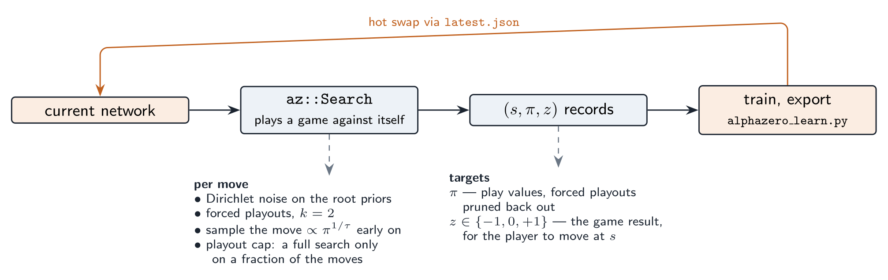{#fig-selfplay width=100%}

This is *generalised policy iteration*: the search does the policy improvement
step and the gradient descent does the policy evaluation step. No human games,
no hand-made evaluation: the only knowledge injected is the rules, through the
legal moves and the final score.

Why does it not just go round in circles? Because the two targets pull the
network towards something strictly better than itself. $\pi$ is the result of
looking ahead with the current network — a network that predicts $\pi$ directly
has "compiled" 800 simulations of look-ahead into one evaluation. $z$ is the
*actual* result of the game, which no amount of self-deception can change: a
network that believes a position is won while it keeps losing from there gets
corrected. Each iteration the searches become stronger because the network
guiding them is better, and the targets become better because the searches are
stronger.

Our starting point is not a random network but the supervised
`cnn_resnet_256x30_value_policy.pt`. That changes the tuning (small learning
rate, no need to explore wildly at first) but not the algorithm.

## The pieces and how they talk {#sec-learn-loop}

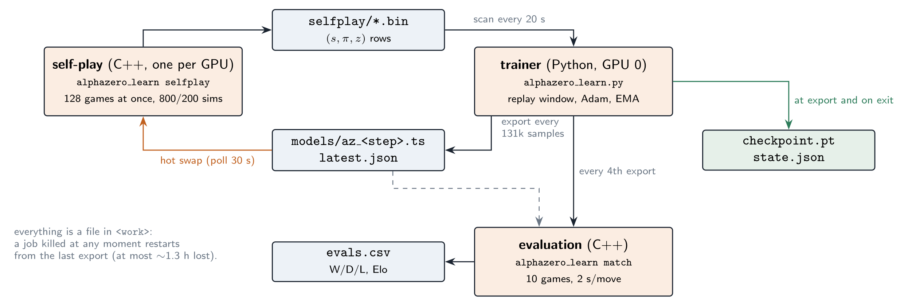{#fig-learn-loop width=100%}

Three programs run at the same time on one node (@fig-learn-loop):

1. **Self-play** — `alphazero_learn selfplay`, C++ (`player/alphazero_selfplay.cpp`),
   one process per GPU. It plays games with the newest network and writes
   training rows to `selfplay/*.bin`.
2. **The trainer** — `nnue/alphazero_learn.py`, Python. It is also the
   orchestrator: it launches and supervises the other two. It keeps a *replay
   window* of recent rows, takes gradient steps, and every `--export-every`
   training samples exports a new network (`models/az_<step>.ts`) and announces
   it in `latest.json`. Self-play picks the new network up at its next poll.
3. **Evaluation** — `alphazero_learn match`, C++ (`test/alphazero_learn_main.cpp`),
   started by the trainer every 4 hours. It plays 20 games of 2 s per move
   between the newest network and the previously evaluated one and appends the
   result to `evals.csv`.

Why files rather than sockets or shared memory? Because the run must survive
being killed. A cluster job ends after two weeks and the loop must continue in
the next one. With every exchange being a file that is renamed into place once
it is complete (a POSIX rename is atomic), a process that dies at any moment
leaves only complete files behind. The next job re-reads them and continues
(@sec-cluster).

There is no *gating*. The original AlphaGo Zero only promoted a new network
after it beat the current one by 55 %; AlphaZero and KataGo dropped this and
always self-play with the latest network, which is simpler and was found to be
at least as good. The evaluation matches here are a **thermometer**, not a
gate: they tell you whether learning progresses, they do not steer it.

## Self-play: many games, one GPU {#sec-sp-driver}

### Why many games at once

A 30-block network is only efficient on the GPU with large batches: about 7 600
positions/s at batch 256 in fp16 on an RTX 3080, a small fraction of that at
batch 8. A single MCTS, on the other hand, degrades when it evaluates many leaves
at once: with a batch of $B$ leaves it must choose $B$ descents *before* knowing
any of their results (virtual loss), and beyond a few dozen leaves the descents
collide and wander.

The solution is to decouple the two: run **many independent games**, each with
its own single-threaded `az::Search` asking for only 8 leaves at a time, and let
an `nn::BatchingEvaluator` merge the requests of all the games into one GPU
call (@fig-sp-batch). With 128 games the GPU sees batches of up to 1024
positions, while each search behaves almost like a sequential one.

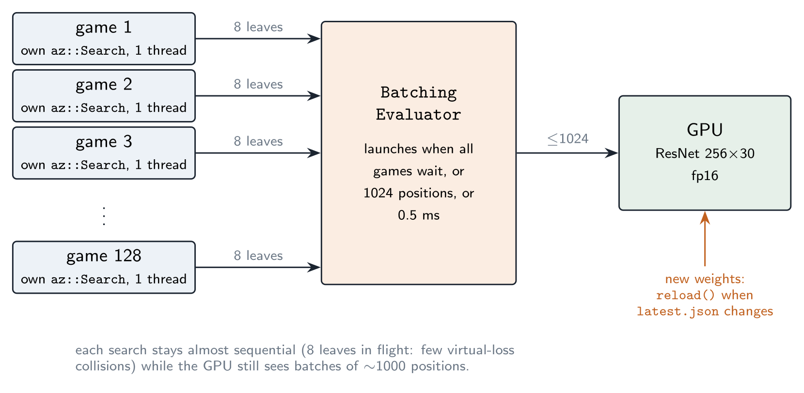{#fig-sp-batch width=90%}

The batcher launches a GPU call as soon as *every* game is waiting, or the
maximum batch (8 × number of games) is queued, or 0.5 ms have passed. When a
game ends, its thread immediately starts the next one, so the number of games
in flight stays constant; `set_nb_clients` is lowered only when a thread really
exits (at the end of the run), otherwise the batcher would wait 0.5 ms for a
client that will never come.

How many games? Enough to saturate the GPU, no more. On the RTX 3080, 128 games
already keep it at 95 % and reach ~8 500 evaluations/s; 256 games do not do
better (the batches get larger but the GPU was already busy). Two processes of
64 games on the same GPU do *worse*, ~6 000/s in total: each batch is half as
large and the two processes contend for the device. Hence one process per GPU,
with as many games as the GPU can absorb: 256 on the 48 GB cluster GPUs, which
(A40 and RTX 8000) should have 2–2.5 times the fp16 throughput of a 3080 (@sec-learn-sizing).

The code of one game is short enough to read in full:

```cpp
Yolah y;
std::vector<TrainingSample> samples;
search.reset();                                   // new game: forget the graph
while (!y.game_over() && !stop.load()) {
    const uint64_t g = generation.load(std::memory_order_acquire);
    if (g != seen) {                              // the network changed:
        search.reset();                           //   the graph's priors and values
        search.clear_cache();                     //   and the cached evaluations are stale
        seen = g;
    }
    const SearchResult r = search.search(y);      // 800 or 200 simulations
    if (r.full_search && !r.children.empty())     // only full searches are recorded
        samples.push_back(make_sample(y, r, model_step.load()));
    y.play(r.best_move);                          // sampled ∝ π^(1/τ) early, best later
}
// ... then z is filled in for every sample, and the game goes to the writer
```

### The self-play settings, and why

`config/alphazero_mcts_selfplay_player.cfg`:

| key | value | why |
|---|---|---|
| `nb simulations` | 800 | the budget of a *full* search (AlphaZero) |
| `playout cap fast prob` / `nb simulations fast` | 0.75 / 200 | playout cap randomization, @sec-playoutcap |
| `dirichlet epsilon` / `alpha` | 0.25 / 0.3 | root noise: tries moves the prior would never try |
| `temperature` / `temperature cutoff` | 1.0 / 20 | the first 20 plies are *sampled* $\propto \pi$: diverse openings |
| `forced playouts k` | 2 | every root move tried at least $\sqrt{k\,P\,N}$ times |
| `policy target pruning` | true | … and those forced visits are removed from $\pi$ again |
| `batch size` | 8 | leaves per search per network call (see above) |
| `nn cache` | 16 MB | per game; the cluster job raises it to 32 MB (768 games × 32 MB = 25 GB) |

**Playout cap randomization** deserves a word, since it shapes the data. Value
targets are cheap: every position of a game gets the game result $z$. Policy
targets are expensive: a good $\pi$ needs a big search. KataGo's observation is
that one can play *most* moves with a small search (200 simulations, no noise)
— the game advances four times faster — and do a full 800-simulation search, and
record a training row, only on a random 25 % of the moves. More games per hour
means more value targets and more diverse positions; the policy targets that are
recorded all come from full searches. The fast moves are **not recorded at
all**: their $\pi$ would be a poor target, and recording only their $z$ would
over-weight the value head.

Per recorded row this costs, on average, one full search plus three fast ones:
$800 + 3 \times 200 = 1\,400$ simulations, a little less in network calls since
tree reuse and the network cache save some. Measured: ~1 200 network
evaluations per training row. That single number converts any GPU's
evaluation rate into a data rate (@sec-learn-sizing).

### What a training row contains

Each recorded position becomes a fixed-size, 336-byte record
(`az::TrainingSample` in `player/alphazero_selfplay.h`, mirrored field by field
by `SAMPLE_DTYPE` in `alphazero_learn.py`):

| field | type | meaning |
|---|---|---|
| `black`, `white`, `empty` | 3 × `uint64` | the bitboards — exactly the network's input |
| `turn` | `uint8` | 0 = black to move, 1 = white |
| `z` | `int8` | final result for the side to move: $-1, 0, +1$ |
| `nb_moves` | `uint8` | number of legal moves stored |
| `root_q` | `float` | the search's value of the position (monitoring) |
| `model_step` | `uint32` | which network played this move |
| `action[75]` | `uint16` | policy index `from*64+to` of each legal move |
| `prob[75]` | `uint16` | $\pi(a)\cdot 65535$, rounded |

$\pi$ is stored sparsely, over the legal moves only (at most 75 in Yolah),
quantised to 16 bits — a resolution of $1.5\times10^{-5}$, far below the noise of
an 800-visit estimate. A dense 4096-float target would take 16 KB per row
instead of 336 bytes.

The value target is filled in when the game ends. In Yolah every move scores
one point for the player who makes it, so the final scores are the numbers of
moves each side managed to make. A position where colour $c$ is to move gets

$$
z = \operatorname{sign}\big(\text{score}_c - \text{score}_{\bar c}\big) \in \{-1, 0, +1\},
$$

the same convention as the network's value head and the search's
`terminal_value`.

Rows are grouped in files of about 2 000 (or every 10 minutes), named
`<milliseconds since 1970>_<host>_gpu<k>_<seq>.bin`. Sorting the names sorts the
files by age, across GPUs, hosts and jobs, which is all the trainer needs.

### Hot-swapping the network

The supervisor thread of `run_selfplay` reads `latest.json` every 30 s. When the
step changes it calls `evaluator.reload(path)`. That is safe while hundreds of
games are searching: the libtorch backend takes its own mutex both in
`evaluate` and in `load`, so a reload simply waits for the batch in flight and
the next batch runs on the new weights. The supervisor then bumps an atomic
`generation`; each game notices it before its next move and throws away its
graph and its network cache, whose values came from the old weights. The rest
of the game is played by the new network — a game may thus mix two consecutive
networks, which KataGo also accepts: consecutive networks differ by a few
hundred gradient steps.

## The trainer {#sec-trainer}

### The replay window

Which rows should the network learn from? Only the most recent ones are made by
a network close to the current one; old rows describe the play of a weaker
player and their $\pi$ is a worse target. But too small a window over-fits the
last few thousand games. KataGo's answer (`python/shuffle.py`) is a window that
grows **sub-linearly** with the total number of rows $N$ generated so far:

$$
W(N) = N_0\left(1 + \beta\,\frac{(N/N_0)^{\alpha} - 1}{\alpha}\right),
\qquad \alpha = 0.75,\ \beta = 0.4 .
$$

For $N \le N_0$ everything is used. After that the window keeps growing — a
stronger network deserves more data to fit — but slower and slower, so the
fraction of the history in use shrinks: with KataGo's $N_0 = 2.5\cdot10^5$
(the cluster setting), $W$ is 1.1 M rows (31 %) at $N = 3.5$ M and 12 M
(12 %) at $N = 100$ M (@fig-window). The derivative tells the same story:
$W'(N) = \beta\,(N/N_0)^{\alpha-1}$ is the fraction of each new batch of rows
that *enlarges* the window rather than replacing its oldest rows — 40 % at the
start, 9 % after 100 M rows. $W$ is also capped by `--max-window` (16 M rows,
5.4 GB of RAM on the cluster).

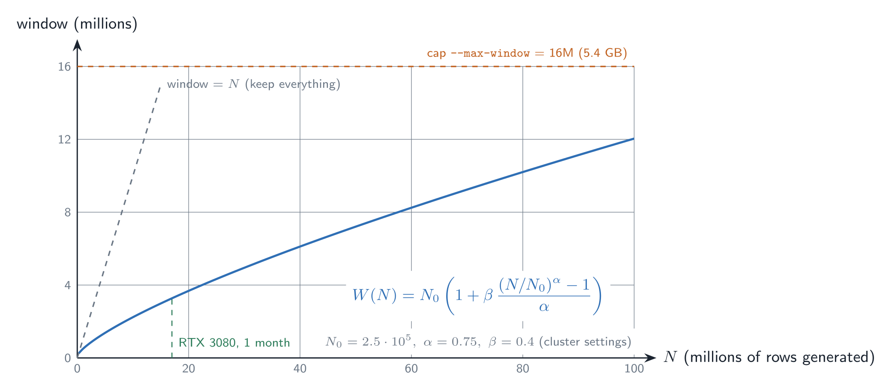{#fig-window width=90%}

The implementation is a **ring buffer** of `--max-window` rows. New files are
appended at the head; a batch draws uniform indices among the last $W(N)$ rows:

```python
def sample(self, batch_size, rng):
    w = self.window_size()
    back = rng.integers(1, w + 1, size=batch_size)      # 1 = newest row
    return self.buf[(self.head - back) % self.capacity]
```

On a restart, only the files that can still be in the buffer are read (the tail
of the history, newest first until the capacity is reached); the headers of the
others are enough to know $N$.

### How much to train: the reuse ratio

The trainer and self-play run concurrently, so something must keep them in
step. If the trainer ran freely it would take thousands of steps on the first
rows and over-fit them; if it were too slow, self-play would keep playing
with an outdated network. The rule is a **fixed number of training samples per
generated row** (`--reuse`, default 4):

$$
\text{samples trained} \;\le\; r \cdot N .
$$

When the trainer reaches the bound it sleeps until more rows arrive. With
$r = 4$ each row is drawn about 4 times while it is in the window (in
expectation; the draws are random). Training starts when $N \ge N_0$.

The trainer is never the bottleneck: one GPU trains the 256×30 network at
~3 400 samples/s (RTX 3080, batch 1024, 4.9 GB), while even three cluster GPUs
of self-play generate a few tens of rows per second, i.e. a hundred or two
training samples per second at $r = 4$.

### The loss

For a row $(s, \pi, z)$ and the network output $(v, \ell)$ — value and the 4096
logits — the loss is the AlphaZero one with a **soft** policy target:

$$
\mathcal{L}(\theta) \;=\; \lambda_v\,\big(v_\theta(s) - z\big)^2
\;-\; \lambda_p \sum_{a\,\in\,\text{legal}(s)} \pi(a)\,\log p_\theta(a \mid s),
\qquad
p_\theta(a\mid s) = \frac{e^{\ell_a}}{\sum_{b=1}^{4096} e^{\ell_b}} .
$$

With $\lambda_v = \lambda_p = 1$. Three remarks:

* The softmax runs over all 4096 logits, like in supervised training; the
  illegal moves are simply never targets, so their logits are pushed down. The
  search itself only ever reads the legal ones.
* The policy term is a cross-entropy, which decomposes as
  $H(\pi, p) = H(\pi) + \mathrm{KL}(\pi \,\|\, p)$. The entropy $H(\pi)$ of the
  targets does not depend on $\theta$, so what the gradient reduces is the KL
  divergence. The trainer logs both `p` (the cross-entropy) and `kl` — the
  latter is the interpretable one: 0 means the network already predicts what
  the search finds.
* The gradient of the policy term with respect to the logits is simply
  $\partial\mathcal{L}/\partial \ell_a = \lambda_p\,(p_\theta(a\mid s) - \pi(a))$:
  every logit is pushed up or down by how much the network under- or
  over-estimates what the search found.

In code, with the sparse targets gathered from the log-softmax:

```python
v, logits = net(x)
logp   = F.log_softmax(logits.float(), dim=1).gather(1, actions)   # (B, 75)
p_loss = -(probs * logp).sum(1).mean()                              # padding has prob 0
v_loss = F.mse_loss(v.float(), z)
loss   = args.value_weight * v_loss + args.policy_weight * p_loss
```

### Optimiser and numerics

* **Adam**, learning rate $10^{-4}$ (the supervised run ended its cosine schedule
  at $10^{-5}$ from $10^{-3}$), L2 weight decay $10^{-4}$ as in supervised
  training, a linear warm-up over the first 500 steps (the optimiser's moment
  estimates start from zero after a fresh start), gradient norm clipped at 5.
* **Mixed precision** chosen as in the supervised trainer: bf16 on Ampere and
  newer (the cluster's A40), fp16 with a gradient scaler on Turing (its RTX
  8000, whose bf16 is emulated and slow). Consecutive jobs of one run may land
  on either, so the checkpoint must survive the switch: a bf16 job saves the
  state of a *disabled* gradient scaler, which is empty and which an enabled
  scaler refuses to load. The trainer then simply starts the scaler afresh —
  its scale adapts within a few steps. (`--amp` forces one or the other; that
  is how both switches were tested.)
* **Batch 1024**, channels-last memory layout (faster convolutions on tensor
  cores), `cudnn.benchmark` on — without it, cuDNN's default algorithms for
  this layout were an order of magnitude slower in our measurements.
* BatchNorm is in training mode: its running statistics follow the self-play
  data distribution.

### Data augmentation: the 8 symmetries {#sec-symmetries}

The rules of Yolah do not change if the board is rotated by a quarter turn or
mirrored: pieces move like queens and the initial position is symmetric. The
position $s$ and its image $g(s)$ under any of the 8 symmetries $g$ of the
square (the dihedral group $D_4$) therefore have the same value, and the policy
of $g(s)$ is the policy of $s$ with every move transformed by $g$:

$$
v(g\,s) = v(s), \qquad \pi(g\,a \mid g\,s) = \pi(a \mid s).
$$

Each training row is shown to the network under a random one of the 8
transformations — eight times more data for free, and a network pushed towards
the symmetry it should respect (@fig-symmetries).

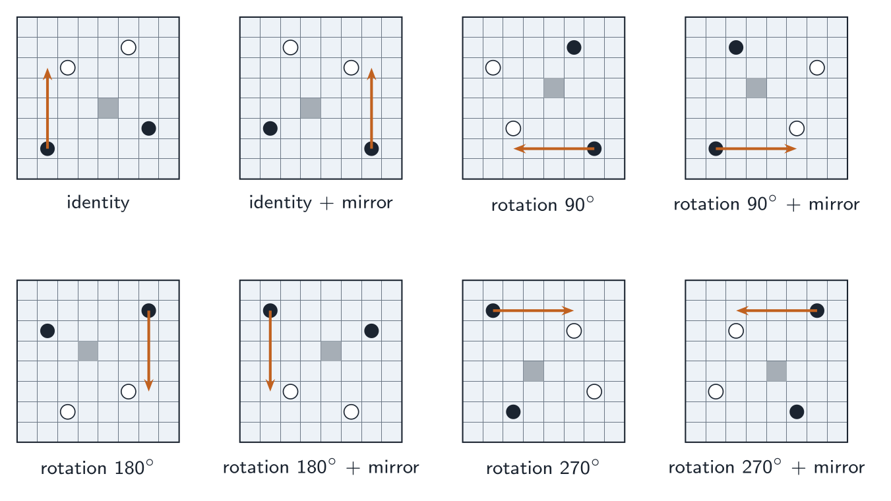{#fig-symmetries width=90%}

The only subtlety is bookkeeping. The network input stores square $q$ in plane
cell $c = 63 - q$ (@sec-encoding), and moves are indexed by *squares*. The
tables are therefore computed on cells and converted:

```python
cells = torch.arange(64).view(8, 8)
src = [f(rot90(cells, k)) for k in 0..3 for f in (identity, flip)]  # (8, 64)
# new plane cell j takes the value of old cell src[g, j]
inv = argsort(src)                        # inv[g, old cell] = new cell
sq  = 63 - inv[:, 63 - arange(64)]        # old square -> new square
act = sq[:, :, None] * 64 + sq[:, None, :]  # (8, 4096): move index -> move index
act[:, 0] = 0                              # index 0 is the pass, and stays the pass
```

The planes are permuted with one `gather`, the move indices with one table
lookup, both on the GPU. The tables were checked against the rules: for 200
self-play positions and all 8 symmetries, the transformed legal moves of $s$
are exactly the legal moves of $g(s)$ computed by `server/yolah.py`.

### Averaging the weights before export

The weights after the last gradient step are a noisy point: SGD bounces around
the minimum. KataGo exports a *stochastic weight average* of recent snapshots;
here we keep an **exponential moving average** of the weights, updated after
every step:

$$
\bar\theta \leftarrow \mu\,\bar\theta + (1-\mu)\,\theta, \qquad \mu = 0.995 .
$$

Unrolled, $\bar\theta_t = (1-\mu)\sum_{k\ge0}\mu^k\,\theta_{t-k}$: step $t-k$
weighs $\mu^k$, the weights have mean age $\mu/(1-\mu) \approx 200$ steps. It
is $\bar\theta$ that is exported and played by self-play, $\theta$ that keeps
training. The BatchNorm running statistics are averaged the same way
(`AveragedModel(..., use_buffers=True)`), so that the exported network is
consistent.

### Export and publication

Every `--export-every` training samples (524 288 = 512 steps of 1024 on the
cluster; with 4 samples per row, one network every 131 072 new rows):

1. `az_<step>.pt` — the plain `state_dict` of $\bar\theta$ (it can be fed to
   `resnet_export.py` for the CPU `.bin` backend);
2. `az_<step>.ts` — the network traced with `torch.jit.trace` in eval mode,
   exactly like `resnet_export.py` does, for the libtorch backend;
3. `latest.json` rewritten — self-play switches within 30 s;
4. `checkpoint.pt` (weights, EMA, optimiser, gradient scaler) and `state.json`
   (counters, evaluation state) rewritten.

Every write goes to a temporary name and is `os.replace`d into place.

A 256×30 network is 141 MB per file and a month produces hundreds of exports,
so old files are pruned (`cleanup_models`): an export that was never evaluated
disappears at the next export; an evaluated one keeps its `.pt` — the history
of the run, at 141 MB per evaluation — but loses its `.ts` once it can no longer
be an opponent. If it is needed again (`--eval-opponents lag:K`),
`Evaluator.ensure_ts` re-traces it from the `.pt`; the re-traced module gives
bit-identical outputs. `--keep-all` disables pruning.

## Measuring progress {#sec-eval}

### The match protocol

Every 4 hours (`--eval-hours`; the first export of a run is evaluated at once),
the newest network plays **20 games** against an older one, **2 seconds per
move**, both sides using the competitive settings of
`config/alphazero_mcts_eval_player.cfg` (no noise, no sampling, LCB). The
opponent is by default the **previously evaluated network**
(`--eval-opponents previous`; `initial` and `lag:K` are also available and can
be combined). The schedule is in wall-clock time rather than in exports because
the export rate depends on the GPUs, which differ between the development
machine and the cluster; `--eval-every K` switches to one evaluation every $K$
exports.

A detail matters here. Two deterministic players repeat the same game from the
same position: 10 games with the new network as black would be *one* game
played ten times. So each pair of games starts from a fresh random opening of 4
plies, and the new network plays it once with each colour (@fig-eval). The pair
cancels the bias of the opening, whichever side it favours — and the first
player's advantage in Yolah is large (@sec-learn-sizing).

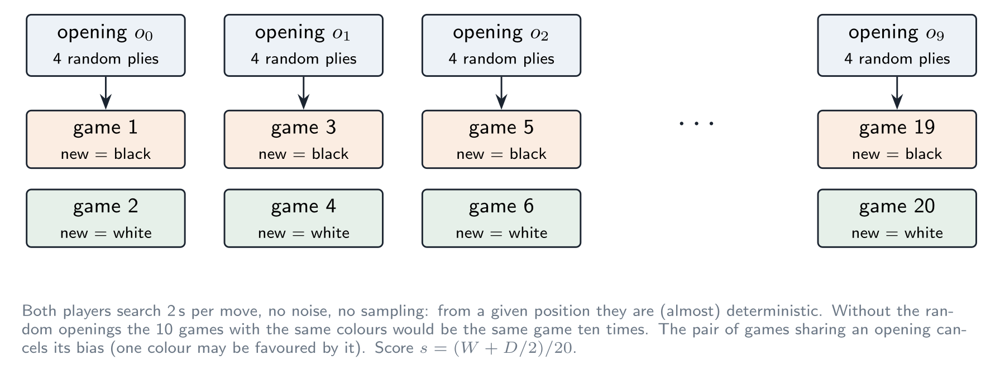{#fig-eval width=100%}

A match takes $20 \times 55 \times 2\ \text{s} \approx 37$ minutes. It runs on
the last GPU while that GPU also plays self-play games: both players suffer the
same contention, so the comparison is fair, but "2 s per move" buys fewer
simulations than on an idle GPU.

### From a score to Elo

With $W$ wins, $D$ draws and $L$ losses out of $n = 20$ games, the score is
$s = (W + D/2)/n$. Under the Elo model the expected score of a player $\Delta$
points stronger is $1/(1+10^{-\Delta/400})$; inverting,

$$
\Delta = 400 \log_{10}\frac{s}{1-s} .
$$

A 20–0 result would give $\Delta = \infty$, so the estimate uses a half-game
prior: $\tilde s = (W + D/2 + 1/2)/(n + 1)$, which caps $|\Delta|$ at 645. Each
evaluation adds its $\Delta$ to the opponent's rating, giving a **chained Elo**
for every evaluated network relative to the initial one (`model_elo` in
`evals.csv`).

::: {.callout-warning}
## Twenty games is a thermometer, not a microscope

The standard error of a score over $n$ games is at most $\sqrt{s(1-s)/n}$, i.e.
0.11 for $n = 20$ near $s = 0.5$ (less if there are many draws). Through the
slope of the Elo curve at $s = 0.5$, $d\Delta/ds = 1600/\ln 10 \approx 695$,
that is **±78 Elo** for one evaluation. The chained Elo accumulates the errors
of every link like a random walk: ±78·$\sqrt{k}$ after $k$ links. Read the
**trend** over many evaluations, not any single one; a run that learns shows a
chained Elo that climbs steadily. For a precise comparison of two networks at
the end, play a few hundred games (400 games: ±17 Elo):

```bash
./alphazero_learn match --config ../config/alphazero_mcts_eval_player.cfg \
    --a work/models/az_A.ts --b work/models/az_B.ts --games 400 --time 500000
```

Adding `initial` to `--eval-opponents` gives an unchained measurement against a
fixed reference, at the cost of another 20 games per evaluation.
:::

## Running it on the cluster {#sec-cluster}

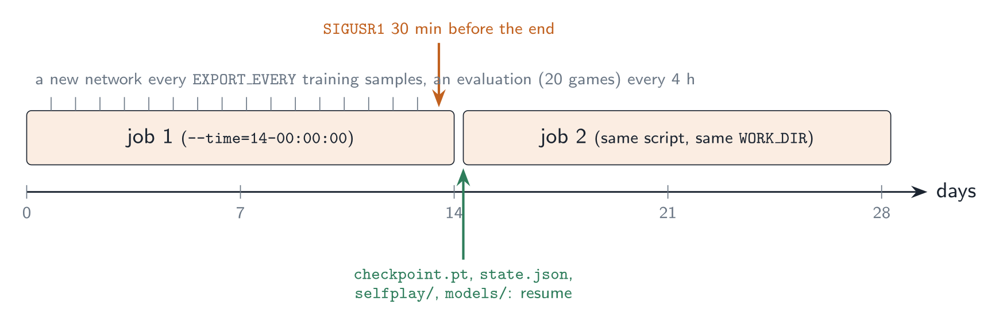{#fig-jobs width=100%}

### The cluster

| resource | what there is | what the run uses |
|---|---|---|
| GPU nodes | 5 nodes, 13 cards of 48 GB: 7 A40, 6 RTX 8000 | 3 cards (the per-user maximum) |
| CPU nodes | 18 nodes, 592 cores, 8 TB of RAM | nothing (see @sec-learn-sizing) |
| `/data` | 44 TB, redundant, visible from every node | the work directory (~60 GB) |
| `/calcul` | 17 TB, distributed | nothing |

The run lives on `/data`: it must survive for a month and be reachable from
whichever node the next job lands on, and its I/O is modest (about 1.2 GB of
self-play rows a day, a 141 MB network per export, small reads by the
trainer), so the redundant storage is the right trade.

### The image

`nnue/alphazero_learn.def` builds a *toolchain* image: CUDA 12.4 with cuDNN,
g++-13 (the code is C++23), Boost, oneTBB, Google benchmark, CMake, Python 3 and
torch 2.6.0 — whose wheel also contains libtorch, the C++ library the
TorchScript backend links against. Unlike the other `.def` files it does **not**
contain the Yolah sources: the job bind-mounts the repository and compiles
`alphazero_learn` on the compute node, at the start of every job (about a
minute). Two reasons: the CMake flags use `-march=native`, and a binary
compiled on the machine that builds the image may use instructions the cluster
CPUs lack (a crash with `SIGILL`); and changing the code then requires a
`git pull`, not a new image. The build is cached in
`WORK_DIR/build/<hash of the CPU model>`.

```bash
# once, on a machine where you are root (or with --fakeroot)
cd nnue && sudo singularity build alphazero_learn.sif alphazero_learn.def
# copy the .sif to the cluster, clone the repo there, copy the initial network
scp alphazero_learn.sif cluster:/data/$USER/AlphaZeroLearn/
# on the cluster: git clone the repository into ~/Yolah, then
scp cnn_resnet_256x30_value_policy.pt cluster:Yolah/nnue/
```

### The job script

`nnue/alphazero_learn.sh` asks for **3 GPUs, 32 CPUs, 128 GB of RAM and 14
days** (@fig-gpus). Its header lists every tunable as an environment variable
(`SELFPLAY_GAMES`, `LR`, `REUSE`, `EVAL_HOURS`, …); the paths (`YOLAH_DIR`,
default `~/Yolah`; `SIF` and `WORK_DIR`, default under `/data/$USER/AlphaZeroLearn`)
and the shell functions shared with the next script live in
`nnue/alphazero_common.sh`. It does two things: compile, then run
`alphazero_learn.py` in the container. The first lines of its output name the
GPUs it got (`nvidia-smi`).

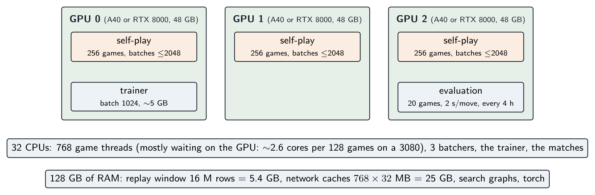{#fig-gpus width=100%}

### Splitting the GPUs over several nodes

The GPU nodes have two or three cards each, and a job asking for three GPUs on
*one* node may wait a long time for one to be completely free. Because the
loop only communicates through files on `/data`, the three GPUs do not have to
be on the same node (@fig-split):

```bash
sbatch --gres=gpu:1 alphazero_learn.sh     # trainer + self-play + evaluations
sbatch alphazero_selfplay.sh               # one more self-play GPU, any node
sbatch alphazero_selfplay.sh               # and another
```

`nnue/alphazero_selfplay.sh` (1 GPU, 12 CPUs, 48 GB) runs only
`alphazero_learn selfplay` on the same work directory. It waits until the main
job has published a network, compiles for its own node (a lock serialises two
jobs compiling for the same CPU model), hot-swaps every new network like the
main job's own self-play, and writes its games under a name that carries its
host and job id — two jobs on one node both see their GPU as number 0, so the
GPU number alone would not be unique. It stops by itself when no new network
has appeared for 6 hours (`--max-stale-hours`): when the main job is over, it
does not keep playing with an outdated network until its own time limit.

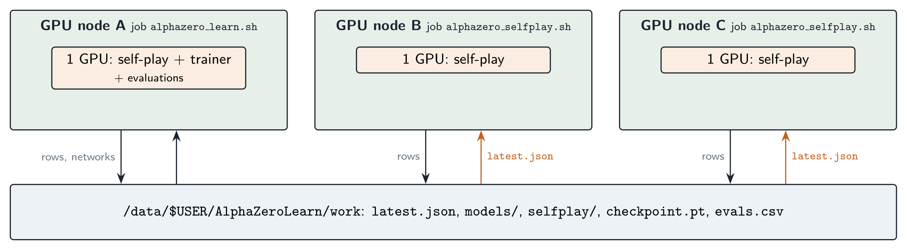{#fig-split width=100%}

### Stopping cleanly

Stopping cleanly matters, because the last minutes of a job are the ones that
would otherwise be lost:

* `#SBATCH --signal=B:USR1@1800` makes SLURM send `SIGUSR1` to the batch script
  30 minutes before the time limit. The script's `trap` forwards it as `SIGTERM`
  to the trainer, which stops at its next step, writes `checkpoint.pt`, sends
  `SIGTERM` to the self-play processes — they finish their current searches,
  write the finished games and exit — and stops the evaluation (which stays in
  `pending_evals` and is played first by the next job).
* In case the signal is lost, the script also reads the job's remaining time
  (`squeue -o %L`) and passes `--max-hours` = that minus 20 minutes.
* The job script starts the container with `exec`, so the signal reaches
  Singularity itself, which forwards it into the container. Sending it to a
  bash subshell around Singularity would kill the subshell and leave the
  trainer and its self-play processes running as orphans. This was caught in
  testing.
* The trainer refuses to start if it cannot see a GPU. The usual cause is a
  container whose CUDA driver is not bound, and without the check self-play
  would fall back to the CPU and run about 50 times slower for two weeks.
  The self-play log's second line names the backend and device actually used.
* Even a `kill -9` loses at most the work since the last export and the games
  in progress: self-play rows are on disk as soon as a file is complete.

To continue, submit **the same script with the same `WORK_DIR`**:

```bash
sbatch alphazero_learn.sh          # days 0-14
sbatch alphazero_learn.sh          # days 14-28: resumes from WORK_DIR
```

`RESUBMIT=1` makes the job resubmit itself after a clean stop (never after a
crash, to avoid a resubmission loop).

### What to watch

| file | what it tells you |
|---|---|
| `alphazero_learn_<job>.out` | the trainer's log: losses every 2 min, exports, evaluations |
| `WORK_DIR/evals.csv` | one line per match: W/D/L, score, Elo difference, chained Elo |
| `WORK_DIR/train_log.csv` | step, rows, window, value loss, policy loss, KL, samples/s |
| `WORK_DIR/logs/selfplay_gpu<k>.log` | games/s, rows/s, evals/s, game length, colour balance (every 5 min) |
| `WORK_DIR/logs/eval.log` | every evaluation game, move by move result |
| `WORK_DIR/evals/*.json` | the complete record of every evaluation game |

Healthy signs: the value loss slowly decreasing, the KL staying small (the
network keeps up with the search, typically a few tenths), the chained Elo
climbing, the colour balance of self-play evolving slowly. Warning signs: a
value loss that collapses towards 0 (the window is too small: it memorises), a
KL that keeps growing (the learning rate is too small or the reuse too low),
games getting systematically shorter (a degenerate strategy — look at
`evals/*.json`).

## Sizing for the cluster {#sec-learn-sizing}

### What was measured

On the development machine (one RTX 3080, 10 GB, WSL2), with the initial
network and 800/200 simulations:

| quantity | value |
|---|---|
| self-play, 128 games | ~8 500 evaluations/s, GPU at 95 % |
| self-play, 256 games | no better (the GPU is saturated) |
| self-play, 2 processes × 64 games | ~6 000 evaluations/s in total (worse) |
| games | ~0.51 games/s — ~44 000 per day, 55 plies on average |
| training rows (full searches only) | ~6.9 rows/s — ~600 000 per day |
| evaluations per row | ~1 200 |
| trainer, batch 1024 | ~3 400 samples/s, 4.9 GB (alone on the GPU) |
| colour balance | black wins 61 %, white 8 %, draws 31 % |

The last line is a property of Yolah, not of the loop: the first player has a
large advantage, which is why the evaluation plays every opening with both
colours.

### From the measurements to the settings

Self-play is the bottleneck, as in every AlphaZero-like system; the rest is
arithmetic.

**Data rate.** With ~1 200 evaluations per row, a GPU doing $E$ evaluations
per second produces $E/1200$ rows/s, i.e. $72\,E$ rows per day. How fast are
the cluster's cards? The network is convolutions on $8\times8$ boards with 256
channels: compute-bound, in fp16 with fp32 accumulation. The A40 (Ampere,
~150 TFLOPS of fp16 tensor work) and the RTX 8000 (Turing, ~130 TFLOPS) do
that at full rate, whereas a GeForce RTX 3080 does it at half its nominal rate
(~60 TFLOPS). From the specifications, then, a cluster card should be 2 to 2.5
times a 3080. Taking a conservative 2×:
$3 \times 17\,000$ evaluations/s $\approx$ 3.6 M rows per day, **~100 M rows in 28
days** ($\approx$ 7 M games). Each self-play log prints `evals/s`, so the real number
is known after five minutes; everything below scales linearly with it.

**Games per GPU: 256.** Enough to saturate a GPU 2–2.5 times faster than the
3080, which saturates at 128. More games cost only RAM and threads, both
plentiful. One process per GPU (measured above: two per GPU is worse).

**Replay window: $N_0 = 250\,000$, cap 16 M.** KataGo's own $N_0$. At 3.6 M
rows/day the first 250 000 rows arrive within two hours, and after a month
$W(N) \approx 12$ M rows (@fig-window) — 4 GB, well under the 16 M cap
(5.4 GB) chosen to leave headroom if the GPUs are faster than assumed.

**Export every 524 288 samples.** At $r = 4$ that is a new network every
131 072 rows, about every 50 minutes at 3.6 M rows/day — frequent enough for
self-play to play with a fresh network, rare enough that the export (a trace
and two 141 MB files) is negligible.

**Evaluation every 4 hours, 20 games.** Six per day, 37 minutes each on the
last GPU: about 15 % of that GPU's self-play. About 170 evaluations over the
month, i.e. a 24 GB history of evaluated networks.

**RAM and CPUs.** 768 games × 32 MB of network cache = 25 GB, the replay
buffer 5.4 GB, plus the search graphs and torch: well under the 128 GB
requested. The game threads spend most of their time waiting for the GPU: on
the 3080, 128 games used ~2.6 cores. The CPU work (descents, backups, encoding
the positions) is proportional to the number of *evaluations*, not to the
number of games, so a GPU twice as fast needs about twice that: $3 \times 2
\times 2.6 \approx 16$ cores for self-play, plus the trainer's data pipeline
and the 4 search threads of each evaluation player. 32 CPUs leave a comfortable
margin, and asking for less than a whole node makes the job easier to
schedule.

**Heterogeneous GPUs.** A job may get A40s, RTX 8000s or, in principle, a
mix. Self-play does not care. The trainer switches between bf16 and fp16 (see
the optimiser notes above). The evaluation compares two networks on the
*same* GPU, so the match is fair whatever the card; but "2 s per move" buys
more simulations on an A40 than on an RTX 8000, so the absolute level of play
of two evaluations made in different jobs may differ slightly — another reason
to read the Elo trend rather than single values. To pin a card type, use the
cluster's gres type (`--gres=gpu:a40:3`; `sinfo -o "%N %G"` lists them).

**Why not the CPU nodes?** Self-play could in principle run on the 592 CPU
cores with the pure C++ backend (`nn::ResNetCPU`). Measured on the development
machine it evaluates 130–160 positions/s on about ten cores; a 33-core node
would do perhaps 450/s, and all 18 nodes ~8 000/s — about half of one A40, for
a gain of roughly 15 % on three GPUs. That would not pay for the complexity (a
second network format to export at every update, jobs spread over 18 nodes)
nor for occupying a shared resource. The GPUs are where the network is fast.

**Disk.** ~34 GB of self-play rows for 100 M rows, ~24 GB of evaluated
networks: plan for ~60 GB in `WORK_DIR`.

## Parameters of the learning loop {#sec-learn-parameters}

All are command-line options of `alphazero_learn.py`; the `.sh` exposes the
important ones as environment variables and sets the cluster values:

| option | default | cluster (`.sh`) | meaning |
|---|---|---|---|
| `--selfplay-games` | 128 | 256 | concurrent games per self-play process (one per GPU) |
| `--selfplay-set 'k=v'` | | `nn cache=32` | override a key of the self-play config |
| `--batch-size` | 1024 | 1024 | training batch |
| `--lr` | 1e-4 | 1e-4 | Adam learning rate (after warm-up) |
| `--warmup-steps` | 500 | 500 | linear warm-up |
| `--weight-decay` | 1e-4 | 1e-4 | L2 |
| `--ema-decay` | 0.995 | 0.995 | weight averaging for export; 0 = raw weights |
| `--reuse` | 4 | 4 | training samples per generated row |
| `--min-rows` | 100 000 | 250 000 | $N_0$: rows before training starts, window base |
| `--max-window` | 4 M | 16 M | ring buffer capacity |
| `--export-every` | 131 072 | 524 288 | training samples between two networks |
| `--eval-hours` | 4 | 4 | time between two evaluations |
| `--eval-every` | 0 | | evaluate every $K$ exports instead (0 = use `--eval-hours`) |
| `--eval-games` / `--eval-seconds` | 20 / 2 | 20 / 2 | the match |
| `--eval-opening-plies` | 4 | 4 | random plies before each pair of games |
| `--eval-opponents` | previous | previous | `previous`, `initial`, `lag:K`, comma separated |
| `--train-gpu` / `--eval-gpu` | 0 / −1 | | trainer on the first GPU, matches on the last |
| `--keep-all` | off | | keep every exported network |
| `--max-hours` | 0 | time limit − 20 min | stop cleanly after this long |
| `--no-selfplay` | off | | train only (self-play running elsewhere) |
| `--allow-cpu` | off | | run without CUDA (tests only) |
| `--amp` | auto | | trainer precision: `auto` (bf16 on Ampere+, else fp16), `bf16`, `fp16` |

## KataGo's auxiliary heads {#sec-aux-heads}

Everything so far trains the network on two targets per position: one scalar
$z$ and one distribution $\pi$. KataGo's most effective idea on top of AlphaZero
is to ask the network for **more predictions than the search needs** — extra
*heads* that exist only during training (@fig-aux-heads). This section explains
what they are, why they help, what they would be in Yolah, and how they would
fit into this code. They are not implemented yet.

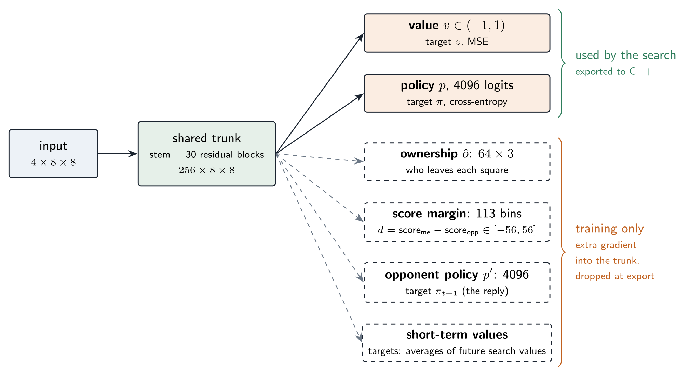{#fig-aux-heads width=100%}

### Why predicting more helps

Think of the information a game gives to the value head: **one bit-and-a-half**
— win, draw or loss — shared by 55 positions. A position early in the game
gets the credit or blame for 50 later moves it had nothing to do with. The
value target is extremely *noisy*, and that noise is what makes value learning
the slow part of AlphaZero.

An auxiliary target is any quantity that is (a) known at the end of the game
for free, (b) much richer than $z$, and (c) related to what the network must
understand. Its head is small — a 1×1 convolution and a linear layer on top of
the shared trunk — and is thrown away at export time. What remains is its
**gradient into the trunk**: the trunk must now compute features that also
predict the auxiliary target, and features that explain *where* and *by how
much* a game is won are exactly the features that make the value head accurate.
It is regularisation by multi-task learning, and in the KataGo paper's
ablations removing these targets slows learning down markedly, most of all
early in a run.

The total loss becomes a weighted sum; the weights are small because the
auxiliary heads must shape the trunk without dominating the two heads that
matter:

$$
\mathcal{L} = \mathcal{L}_v + \mathcal{L}_p
+ w_{\text{own}}\,\mathcal{L}_{\text{own}}
+ w_{\text{score}}\,\mathcal{L}_{\text{score}}
+ w_{\text{opp}}\,\mathcal{L}_{\text{opp}}
+ w_{\text{stv}}\,\mathcal{L}_{\text{stv}} .
$$

### Ownership

In Go, KataGo predicts for each of the 361 points who owns it at the end of the
game — 361 targets per position instead of one. The loss is a per-point
cross-entropy, scaled by the board area:

$$
\mathcal{L}_{\text{own}} = -\frac{1}{64}\sum_{q=1}^{64}\ \sum_{c}\ o_q(c)\,\log \hat o_q(c),
\qquad w_{\text{own}} \approx 1.5 ,
$$

where $o_q$ is the one-hot final owner of square $q$ and $\hat o_q$ the network's
softmax (KataGo writes the same weight as $1.5/b^2$ on the *sum* over the
$b\times b$ points, which is this mean times 1.5).

Yolah has an exact equivalent, and a particularly clean one. Every move leaves a
hole on the square the piece came from, and scores one point for its player
(`Yolah::play`). So at the end of a game **each square is either a hole left by
black, a hole left by white, or neither**, and the number of holes each player
left *is* their score (@fig-ownership, a real game of the initial network:
29–26). The ownership map is the final score decomposed square by square: it
tells the trunk not only *that* black wins but *which regions* black managed to
use.

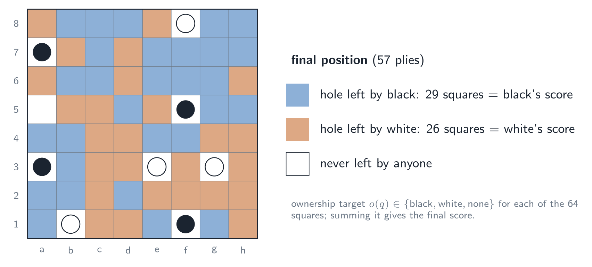{#fig-ownership width=100%}

The head: a 1×1 convolution from the 256 trunk channels to 3 channels (black,
white, none) — an $8\times8\times3$ output, one softmax per square. Relative
to the side to move ("mine / the opponent's / none"), as KataGo does, so that
the target does not depend on the colour. Under the 8 symmetries the ownership
map transforms exactly like the input planes (the same `gather`).

### Score margin

$z$ only says who won. The margin $d = \text{score}_{\text{me}} -
\text{score}_{\text{opp}}$ says by how much, and distinguishes a crushing win
from a lucky one. In Yolah $|d| \le 56$ (64 squares minus 8 pieces), so the head
can predict the whole **distribution** of the margin — 113 logits, one per
possible value — trained with a cross-entropy against the one-hot final margin:

$$
\mathcal{L}_{\text{score}} = -\log \hat P(d_{\text{final}}),
$$

plus, as in KataGo, a term on the cumulative distribution so that predicting
+11 when the truth is +12 costs less than predicting −30:
$\sum_x \big(\hat F(x) - \mathbb{1}[x \ge d_{\text{final}}]\big)^2$ with
$\hat F$ the predicted CDF. KataGo also uses the predicted score in the search
(a small utility for winning by more); here it would be training-only.

### Opponent's reply

A second policy head predicts $\pi_{t+1}$, the search's distribution at the
*next* position — the opponent's reply. It forces the trunk to represent the
opponent's threats, not only one's own options. KataGo's weight is
$w_{\text{opp}} \approx 0.15$. It needs no new data: the target is the $\pi$
of the next row of the same game, when that move was a full search (with
playout cap randomization, 25 % of the time; otherwise the term is masked out).

### Short-term value targets

$z$ is noisy because it is far in the future. Later versions of KataGo add
value targets that look only a few moves ahead: exponentially weighted averages
of the *search values* of the next positions,

$$
v^{(\lambda)}_t = (1-\lambda)\sum_{k \ge 0} \lambda^k\, q_{t+k}\quad(\text{sign-corrected for the side to move}),
$$

with horizons $1/(1-\lambda)$ of a few moves to a few tens of moves, each
trained by its own small head with a squared error. They are the
temporal-difference idea of reinforcement learning: a target that is less
exact than $z$ (it inherits the search's errors) but far less noisy. We already
record the search value (`root_q`) of the full-search positions; the fast
searches' values would have to be recorded too.

### How it would fit into this code

The key point is that **nothing in C++ has to change**:

1. **The network** gets the extra heads as extra modules; `forward` returns
   all outputs during training.
2. **The export** traces a small wrapper whose `forward` returns only
   `(v, p)`; the `.ts` file has the same interface as today, and
   `resnet_export.py` writes the `.bin` from the value and policy weights only,
   so both C++ backends load the network unchanged.
3. **The data** needs, per row, the final ownership map (2 bits × 64 squares =
   16 bytes), the final margin (1 byte), and a game identifier and ply so that
   the trainer can pair a row with the next one of the same game (the
   opponent-policy and short-term targets). That is a version 2 of
   `TrainingSample` — the file header already carries a version and the row
   size precisely for this.
4. **The starting point**: the trunk and the two existing heads load from the
   current network; the new heads start random, with their weights ramped up
   over the first few thousand steps so that their initially large, random
   gradients do not disturb a trunk that already plays well.

The ownership and score heads are the ones with the best ratio of expected gain
to effort: the targets are free, exact and — in Yolah — sum to the very
quantity the game is decided on.
