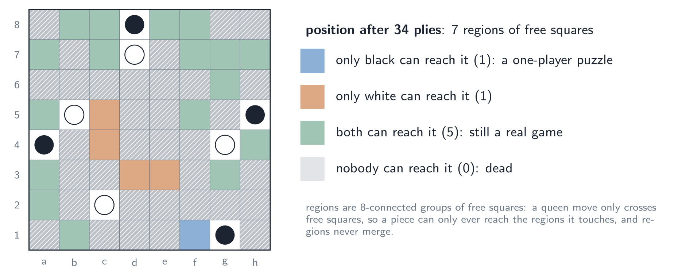
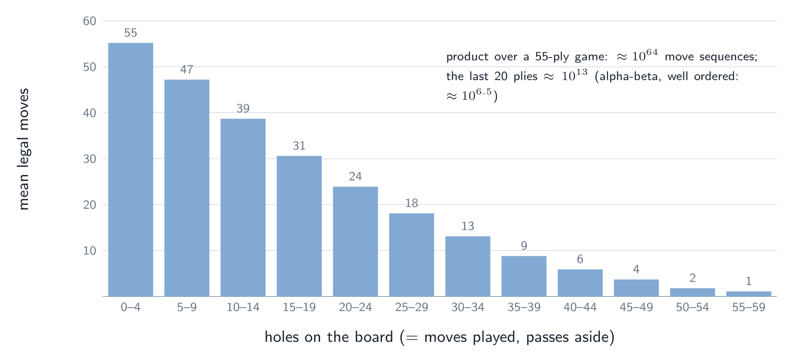

# Solving Yolah {#sec-solving}

Two questions come naturally once a program plays a game well. Could we
compute *exact* values instead of estimating them — at least near the end of
the game, as chess engines do with endgame tablebases built by retrograde
analysis? And could the whole game be *solved*? This chapter works out what
that would take for Yolah. Nothing in it is implemented yet; the numbers come
from the measurements of the previous chapter and from the rules.

The vocabulary is Allis's. A game is **ultra-weakly solved** when the result of
perfect play from the initial position is known, **weakly solved** when a
strategy achieving it is known too, and **strongly solved** when the value of
every position is known. Checkers was weakly solved in 2007, after almost two
decades of work; Othello (8×8) was weakly solved in 2023 — a draw.

## What there is to compute {#sec-solve-value}

The quantity to compute is the one the score head of @sec-auxiliary predicts:
the **rest of the margin** $V(s)$, the number of moves the side to move will
still make minus the number the opponent will, under perfect play by both.
Three properties of Yolah make it pleasant.

**It depends on the board alone.** The score so far does not matter: the final
margin is the margin so far plus $V(s)$, and the margin so far is a constant
that neither player can change any more. A position is therefore just the two
sets of four pieces, the set of holes and the side to move.

**It obeys a simple recurrence.** A move scores one point for its player and
hands the move to the opponent, whose rest of the margin counts against us; a
player who cannot move passes and scores nothing:

$$
V(s) =
\begin{cases}
\max_{m} \big(1 - V(s\cdot m)\big) & \text{if the side to move has moves,}\\
-V(\bar s) & \text{if only the opponent has moves } (\bar s: s \text{ with the other side to move}),\\
0 & \text{if nobody can move (the game is over).}
\end{cases}
$$

**It also solves win / draw / loss.** From the initial position the margin so
far is 0, so black wins, draws or loses according to the sign of
$V(s_0)$. That this sign is also the value of the game played for win / draw /
loss is not obvious — the two objectives could call for different moves — but
it holds because the sign is monotone and minimax commutes with monotone
functions: $\operatorname{sign}(\max(a, b)) = \max(\operatorname{sign} a,
\operatorname{sign} b)$, and likewise for $\min$. Solving the margin game
solves the result, and gives more: by how much.

**The game is acyclic and layered.** Every move adds a hole, and holes never
disappear, so a game lasts at most 56 moves and the positions fall into layers
by their number of holes: a move always goes from layer $k$ to layer $k+1$, and
a pass stays in the layer but can happen at most once in a row. There are no
cycles, no repetitions, no draws by repetition: the recurrence above is a
plain backward induction.

## Retrograde analysis, the textbook way {#sec-retrograde}

Retrograde analysis computes values from the end of the game backwards. For
Yolah it would go layer by layer, from the full boards to the empty one:

1. Every position of the deepest layers is terminal (nobody can move): value 0.
2. For layer $k$, every value needed is either in layer $k+1$ (after a move)
   or in layer $k$ with the other side to move (after a pass, and that
   position is not itself a pass position). Compute them by the recurrence.
3. Store one byte per position ($V \in [-56, 56]$), and divide the work by 16
   with the 8 symmetries of the board and the colour swap
   ($V(\text{black}, \text{white}, H, \text{black to move}) =
   V(\text{white}, \text{black}, H, \text{white to move})$ with the pieces'
   colours exchanged).

Classic retrograde analysis walks *backwards* with **unmoves** rather than
enumerating every position of a layer: from a solved position it generates
its predecessors and updates them. In Yolah an unmove is easy to state: take a
piece of the player who has just moved, standing on $b$; pick a hole $a$ on a
queen line through $b$ whose squares in between are all free; move the piece
back to $a$ and turn $a$ back into a free square. Unmoves visit only positions
that can actually lead to the solved ones, which matters when most of the
formal positions are unreachable.

**Why whole-board tables are out of reach.** In chess, an endgame table is
small because few pieces are left. In Yolah the number of pieces never
decreases — there are always eight — and what shrinks is the free space. But
the holes that bound it can be *anywhere*: a table of all positions with only
$F$ free squares has to choose which $8 + F$ squares are not holes, where the
pieces are among them, and whose they are:

| free squares $F$ | positions (after the 16 symmetries) |
|---|---|
| 4 | $1.4 \times 10^{16}$ |
| 8 | $5.5 \times 10^{19}$ |
| 12 | $2.2 \times 10^{22}$ |

Even the table of the last few moves is larger than the biggest endgame
databases ever built. A tablebase of *whole positions* is not the right tool.

## Regions: what makes endgames small {#sec-regions}

What saves the day is that late positions fall apart (@fig-regions). A queen
move only crosses free squares, and consecutive squares on a line are
neighbours (8-connectivity). So a piece can only ever reach the free squares
of the **regions** — 8-connected groups of free squares — it touches, and two
regions never merge: squares only ever stop being free. A late position is a
**sum of independent sub-games**, one per region.

{#fig-regions width=100%}

**A region only one player can reach** is a one-player puzzle: how many moves
can my pieces make in it? The answer depends only on the region's shape and on
where my pieces stand along it, not on the rest of the board. Regions are
small — a few to a dozen squares after the middle game — and their shapes
recur, so their values can be **tabulated once**: the table is keyed by the
region's shape (normalised by translation and by the 8 symmetries) and the
pieces' positions in it. This is where retrograde analysis fits Yolah: not
over whole boards, but over regions. When every region is single-owner, the
game is over in all but name: black makes $M_{\text{black}}$ more moves,
white $M_{\text{white}}$, in whatever order, and
$V = \pm(M_{\text{black}} - M_{\text{white}})$.

**A region both players can reach** is still a real game, and a sum of such
games is not simply the sum of their values: each turn, the player chooses
*which* region to play in, and tempo matters — the theory of such sums is
combinatorial game theory, which was built for exactly this kind of endgame in
the Game of the Amazons, Yolah's closest cousin. In practice an exact solver
searches the sum, with the regions as its unit: a transposition table per
region, the single-owner regions resolved by the table above, and bounds per
region (a region of $n$ free squares cannot change the margin by more than
$n$) for pruning.

## An exact endgame solver {#sec-endgame-solver}

The practical form of all this is an exact solver for the last part of the
game, and @fig-branching shows why it is within reach. The branching factor
collapses as the holes accumulate: about 55 legal moves at the start, 22 on
average, fewer than 10 after 35 holes. The whole game tree is around
$10^{64}$ move sequences, but the last 20 plies weigh only about $10^{13}$ —
and alpha-beta with good move ordering explores roughly the square root of
that, $10^{6.5}$ positions.

{#fig-branching width=100%}

The solver would combine standard techniques, each helped by a property of
Yolah:

* **Null-window alpha-beta (MTD(f)).** A search with window $[\beta-1, \beta]$
  only answers "is $V \ge \beta$?", and prunes far more than a full-window
  search. Margins in Yolah are tiny (@fig-margins: between −2 and +2 in 84 %
  of the games), so two or three such tests, starting from the network's
  estimate, pin the exact value down.
* **Move ordering by the network.** Alpha-beta is only efficient if it tries
  the best move first; the policy head gives exactly that ordering.
* **A transposition table**, and the region decomposition above: tables for
  single-owner regions, per-region bounds, and search restricted to the
  contested regions.
* **Parallelism.** Independent sub-problems (the children of a node, the
  positions of a batch) spread over many cores — and the cluster has 592 CPU
  cores that self-play does not use.

Even without solving the whole game, such a solver pays off:

* **in the search**: below a number of free squares, the MCTS can replace the
  network's estimate by the exact value — what chess engines do with their
  tablebases;
* **in training**: exact values are perfect targets for late positions,
  better than the noisy result $z$;
* **as a measuring stick**: the network's value can be compared with the
  truth, ply by ply.

## Can Yolah be solved? {#sec-can-solve}

**Strongly, no.** The positions are at most
$\binom{64}{4}\binom{60}{4} \times 2^{56} \times 2 \approx 4.5 \times 10^{28}$
(the placements of the pieces, any subset of the other squares as holes, the
side to move). Most are unreachable, but even a small fraction is far beyond
any storage.

**Weakly: maybe, with a serious effort.** The orders of magnitude put Yolah in
the same class as Othello:

| | checkers | Othello 8×8 | Yolah |
|---|---|---|---|
| state space (upper bound) | $\sim 5 \times 10^{20}$ | $\sim 10^{28}$ | $\sim 4.5 \times 10^{28}$ |
| game length | ~50–100 plies | 60 plies | ≤ 56 moves, ~55 plies |
| weakly solved | 2007 | 2023 | — |

A weak solution does not need the whole state space: it needs a proof tree,
in which the solving side plays one good move per position and only the
opponent's replies are all explored. What decides feasibility is how quickly
that tree grows with the depth, and there Yolah has arguments on both sides.
Against it: a very wide opening, with 55 legal moves at the start where Othello
has a handful. For it: endgames that decompose into independent regions, tiny
margins that make null-window searches very effective, and a network that
already orders moves well.

**How to find out.** The honest answer comes from measurement, not from
estimates:

1. write the exact endgame solver of @sec-endgame-solver and check it against
   brute force on small positions;
2. solve self-play positions at 50, 45, 40, 35, … holes, recording the time
   and the number of nodes;
3. fit the growth per ply and extrapolate to the initial position.

If the cost grows by a factor $g$ per ply, going back $k$ plies costs $g^k$
more: the curve says within days whether a weak solution is a matter of
weeks of cluster time, of years, or out of reach — and the solver is useful
anyway.

**What the games already suggest.** The self-play games and the 480 000
supervised games agree (@sec-colour-balance): from the initial position black
wins about 60 % of the games, white about 8 %, and the final margin is almost
always between −2 and +2. That makes it likely that the value of Yolah is
small — a draw or a black win by one or two moves — but that is a statistic
of imperfect play, not a proof. Deciding between "black wins" and "draw" is
precisely what a weak solution would do.
